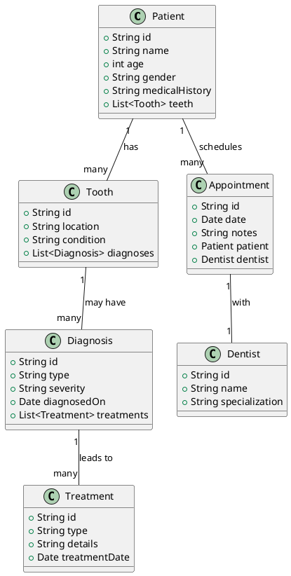

# DentScript Overview

DentScript is a concise dental language designed to standardize the recording of patient information. This document provides an overview of the entities, relationships, syntax, and grammar used in DentScript.

## Key Entities
- [[Patient]]
- [[Tooth]]
- [[Diagnosis]]
- [[Treatment]]
- [[Appointment]]
- [[Dentist]]

## Relationships
- **Patient ↔ Tooth**: A patient has multiple teeth.
- **Tooth ↔ Diagnosis**: A tooth can have multiple diagnoses.
- **Diagnosis ↔ Treatment**: A diagnosis may lead to multiple treatments.
- **Patient ↔ Appointment**: A patient can have multiple appointments.
- **Appointment ↔ Dentist**: Each appointment is associated with a dentist.

## Syntax Overview
- See [[DentScript Syntax]] for detailed syntax rules.

## Grammar Rules
- Refer to [[DentScript Grammar]] for detailed grammar guidelines.

# DentScript UML Class Diagram

