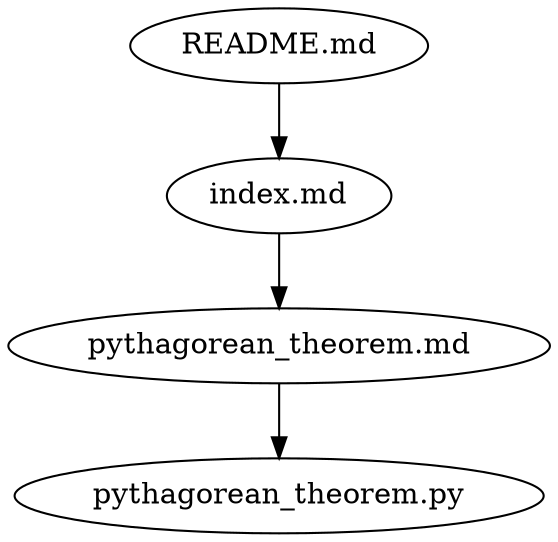
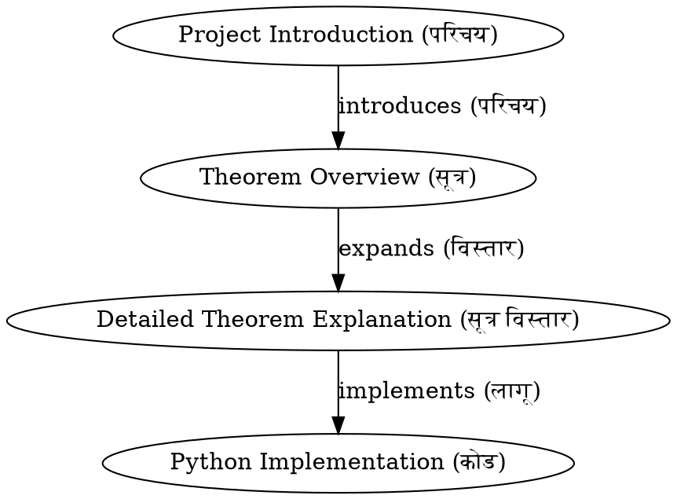
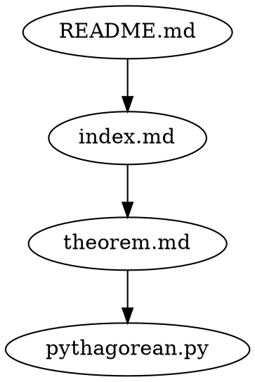

Creating your own constructed language (conlang) with a mix of elements from English, Sanskrit or Telugu, and a logical language like Lobjan is a fascinating endeavor. Here's a guide to help you get started:

### 1. **Define Your Purpose and Audience**
   - **Purpose**: Determine why you're creating this language. Is it for personal use, a creative project, or to simplify communication in a specific field?
   - **Audience**: Decide who will use this language. Will it be just you, a small community, or a wider audience?

### 2. **Design the Phonology (Sounds)**
   - **Base Phonology on Telugu/Sanskrit**: Use the sounds from Telugu or Sanskrit as the base. These languages have rich phonetic systems with a variety of consonants and vowels.
   - **Adapt English Sounds**: Integrate English phonemes where necessary, particularly for borrowed words and terminology.
   - **Consistency**: Ensure that the pronunciation rules are consistent and easy to learn.

### 3. **Create the Morphology (Word Formation)**
   - **Root Words from Telugu/Sanskrit**: Use roots from Telugu or Sanskrit for core meanings. For instance, a root for "knowledge" might be derived from the Sanskrit word "vidya."
   - **Affixes for Logic**: Incorporate Lobjan’s logical constructs through affixes. For example, use prefixes or suffixes to denote logical relationships (e.g., conditionality, causality).
   - **English Terminology**: Integrate English terms for modern concepts, technology, or international ideas, adapting them to your language's phonology.

### 4. **Develop Syntax (Sentence Structure)**
   - **Logical Structure from Lobjan**: Borrow Lobjan’s logical and formal syntax for clear, unambiguous communication. This could involve strict word order or the use of specific particles to denote tense, mood, and aspect.
   - **Flexible Sentence Structure**: Consider allowing flexible sentence structures based on the influence of Telugu or Sanskrit, which can have free word order due to rich inflection.
   - **Syntax Rules**: Create rules for how sentences are formed, using a blend of logic from Lobjan and the natural flow of Telugu/Sanskrit.

### 5. **Define Semantics (Meaning)**
   - **Literal Meanings**: Use Telugu or Sanskrit to convey deeper or traditional meanings, especially for abstract concepts, while English might handle more concrete or technical terms.
   - **Logical Precision**: Ensure that logical constructs have precise meanings, perhaps using a system similar to Lobjan’s strict logical operators.
   - **Contextual Meaning**: Decide how context will affect meaning. Sanskrit and Telugu are context-sensitive languages, so you might incorporate that feature.

### 6. **Create Vocabulary**
   - **Core Vocabulary from Telugu/Sanskrit**: Develop a list of core words for everyday use, deriving them from Telugu or Sanskrit roots.
   - **Technical and Modern Vocabulary**: Adapt English words for modern concepts, ensuring they fit your language’s phonology and syntax.
   - **Logical Operators**: Incorporate a set of logical operators or particles, potentially derived from Lobjan, to handle logical relationships in sentences.

### 7. **Establish Writing System**
   - **Script Choice**: Decide on a script. You might use the Latin alphabet (English), Devanagari (Sanskrit), or Telugu script.
   - **Orthography Rules**: Create rules for spelling, capitalization, punctuation, and other aspects of writing.
   - **Transliteration**: If using a non-Latin script, develop a standard transliteration method.

### 8. **Create Grammar Rules**
   - **Grammar from Lobjan**: Use Lobjan’s logical grammar rules for precise communication, particularly in technical or philosophical contexts.
   - **Morphology from Telugu/Sanskrit**: Develop grammar rules for conjugation, declension, and word formation based on Telugu or Sanskrit grammar.
   - **Integration with English**: Define how English terms fit into your grammar, ensuring consistency.

### 9. **Develop Sample Texts and Dialogues**
   - **Basic Sentences**: Create sample sentences to illustrate grammar, vocabulary, and syntax.
   - **Complex Texts**: Write more complex texts to explore how your language handles different contexts, such as narratives, technical descriptions, or logical arguments.
   - **Everyday Dialogues**: Develop dialogues to demonstrate how your language functions in daily conversation.

### 10. **Test and Refine**
   - **Use in Practice**: Start using the language in real contexts to see how it holds up. This could be through journaling, programming, or even speaking with others.
   - **Refinement**: Continuously refine the language based on its usability, adding or modifying rules, vocabulary, and structure as needed.
   - **Community Input**: If you’re not the only user, gather feedback from others to improve the language’s practicality and coherence.

### 11. **Document Your Language**
   - **Grammar Guide**: Create a comprehensive guide that explains all the rules, including phonology, morphology, syntax, and semantics.
   - **Dictionary**: Develop a dictionary that includes root words, derivatives, and their meanings.
   - **Learning Resources**: If you want others to learn your language, create tutorials, lessons, and exercises.

### 12. **Cultural Integration**
   - **Cultural Concepts**: Incorporate cultural concepts from Telugu, Sanskrit, or your own creations to give the language depth.
   - **Idioms and Proverbs**: Develop idioms, proverbs, and metaphors that resonate with the cultural background of the language.
   - **Literature and Art**: Create or translate literature, poetry, or art into your language to explore its expressive potential.

---

This process requires time and iteration, but by blending the logical precision of Lobjan, the rich morphology of Telugu or Sanskrit, and the global reach of English, you can create a unique and functional language.


Integrating mathematics into your constructed language adds a powerful dimension, enabling precise expression of mathematical concepts alongside everyday communication. Here's how you can implement mathematics into your language:

### 1. **Mathematical Syntax**
   - **Operators**: Define symbols or words for basic mathematical operations (addition, subtraction, multiplication, division) that align with your language's logic and structure.
   - **Logical Operators**: Extend Lobjan’s logical operators to mathematical contexts. For example, you could use similar symbols for "and," "or," "not," and "if-then" in mathematical expressions.
   - **Order of Operations**: Establish clear rules for the order of operations (PEMDAS/BODMAS) within your language’s syntax, ensuring consistency in mathematical expressions.
   - **Function Syntax**: Define how functions are expressed, including their inputs and outputs. Consider how to integrate function notation in a way that fits your language’s overall syntax.

### 2. **Numerals and Number System**
   - **Base System**: Decide on a base system (e.g., base-10, base-12) for your numerals. You might derive numeral names from Telugu, Sanskrit, or create unique ones.
   - **Numeral Representation**: Choose how numerals will be represented in writing. You can use familiar digits (0-9), characters from another script, or create entirely new symbols.
   - **Naming Conventions**: Develop names for numbers, especially larger ones. These names could be derived from roots in Telugu or Sanskrit, with logical suffixes from Lobjan.

### 3. **Mathematical Vocabulary**
   - **Basic Concepts**: Create words for basic mathematical concepts like "number," "equation," "variable," "constant," etc., using roots from Telugu or Sanskrit, and logical suffixes.
   - **Advanced Concepts**: Develop terms for more complex concepts such as "integral," "derivative," "matrix," "vector," and so on. These can be adaptations of English terms or newly coined words.
   - **Terminology Integration**: Ensure that mathematical terminology integrates smoothly with your language’s existing vocabulary, both in pronunciation and meaning.

### 4. **Algebra and Equations**
   - **Variables**: Define how variables are named and used within equations. You can use letters (as in English) or create special symbols from your language’s script.
   - **Equation Structure**: Establish rules for writing equations, including how to represent equality, inequalities, and systems of equations.
   - **Substitution and Manipulation**: Define linguistic constructs for common algebraic operations like substitution, factoring, expanding, etc.

### 5. **Geometry and Spatial Concepts**
   - **Shapes and Figures**: Develop a vocabulary for geometric shapes (e.g., circle, square, triangle) and their properties (e.g., area, perimeter, volume).
   - **Directions and Angles**: Create terms for directions, angles, and other spatial concepts. You might derive these from the spatial vocabulary of Telugu or Sanskrit.
   - **Graphical Representation**: Consider how geometric figures and spatial relationships are described in text and spoken language, integrating with logical and mathematical syntax.

### 6. **Calculus and Higher Mathematics**
   - **Derivatives and Integrals**: Define how to express calculus concepts such as derivatives and integrals. You might use a combination of logical operators from Lobjan and terminology from Sanskrit.
   - **Limits and Series**: Create rules and terms for expressing limits, series, and other advanced mathematical concepts.
   - **Notation**: Decide on notation for higher mathematics, ensuring it aligns with the language’s structure and is easy to follow.

### 7. **Set Theory and Logic**
   - **Set Notation**: Develop symbols or words for sets, subsets, unions, intersections, and other set theory concepts.
   - **Quantifiers**: Define words or symbols for universal and existential quantifiers (e.g., "for all," "there exists") based on Lobjan or Sanskrit.
   - **Logical Proofs**: Establish a system for writing and communicating logical proofs within your language, integrating mathematical logic with natural language.

### 8. **Word Problems and Applied Mathematics**
   - **Problem Formulation**: Create linguistic constructs to formulate word problems clearly and unambiguously, using your language’s logical syntax.
   - **Units and Measurements**: Define terms for units of measurement (length, mass, time, etc.) and how they are used in mathematical contexts.
   - **Practical Applications**: Develop vocabulary and syntax for applying mathematics to real-world scenarios, such as finance, engineering, and science.

### 9. **Mathematical Communication**
   - **Math in Text**: Decide how mathematical expressions are integrated into regular text. Consider the use of inline notation or separate blocks.
   - **Spoken Mathematics**: Develop rules for reading mathematical expressions aloud, ensuring clarity and precision in spoken communication.
   - **Education and Learning**: Create resources for teaching mathematics in your language, including textbooks, exercises, and explanations of mathematical concepts.

### 10. **Examples and Testing**
   - **Create Examples**: Develop example problems, equations, and texts that demonstrate how mathematics is expressed in your language.
   - **Use Cases**: Test your language by solving mathematical problems in various fields (e.g., algebra, calculus, geometry) to ensure it handles different types of mathematics effectively.
   - **Feedback and Iteration**: Gather feedback from others who might use your language, and refine the mathematical aspects based on their input.

### 11. **Documentation**
   - **Mathematical Grammar**: Write a detailed guide explaining the rules for mathematical expressions in your language, including syntax, vocabulary, and notation.
   - **Glossary**: Develop a glossary of mathematical terms, including definitions and examples of their use.
   - **Examples and Exercises**: Provide sample problems and exercises to help others learn how to use mathematics in your language.

---

By integrating mathematics into your language, you can create a powerful tool for both everyday communication and precise mathematical reasoning. This approach will allow users to seamlessly transition between natural language and mathematical expression, making your language both versatile and robust.


### **Creating Your Constructed Language: A Comprehensive Guide**

Here’s a complete guide for creating your language, combining English, Lobjan (for logic), Telugu or Sanskrit (for morphology and meaning), and integrating mathematics.

---

### **1. Purpose and Vision**
   - **Define the Language's Purpose**: 
     - Clarify the language’s primary use—academic, personal, artistic, or practical.
     - Consider its role in enhancing logical precision, expressing cultural nuances, or simplifying complex communication.
   - **Identify the Audience**:
     - Determine whether this language will be used by yourself, a community, or a broader audience.
     - Tailor the language’s complexity and features accordingly.

### **2. Phonology (Sounds)**
   - **Base Phonology**:
     - Utilize Telugu or Sanskrit phonetic systems, which offer rich and varied sounds.
   - **English Integration**:
     - Incorporate English phonemes for borrowed terms and modern vocabulary.
   - **Sound Consistency**:
     - Create a consistent set of rules for pronunciation, ensuring that sounds flow well together.

### **3. Morphology (Word Formation)**
   - **Roots from Telugu/Sanskrit**:
     - Base core vocabulary on roots from these languages, focusing on key concepts and cultural elements.
   - **Logical Affixes**:
     - Incorporate Lobjan-like logical affixes for conditionality, causality, and other relationships.
   - **English Terminology**:
     - Adapt English words for modern concepts, fitting them into your phonology and structure.

### **4. Syntax (Sentence Structure)**
   - **Logical Syntax**:
     - Use Lobjan's strict logical structure to ensure clarity and precision.
   - **Flexibility from Telugu/Sanskrit**:
     - Allow for more flexible word order and structures, respecting the grammatical rules of Telugu or Sanskrit.
   - **Sentence Rules**:
     - Define clear rules for how sentences are constructed, blending logical operators with natural language flow.

### **5. Semantics (Meaning)**
   - **Literal and Cultural Meanings**:
     - Use Telugu or Sanskrit to express deep, cultural, or abstract meanings.
   - **Logical Precision**:
     - Apply Lobjan-like semantics for mathematical, logical, and technical contexts.
   - **Context Sensitivity**:
     - Develop rules for how context influences meaning, drawing on the context-sensitive nature of Telugu and Sanskrit.

### **6. Vocabulary Development**
   - **Core Vocabulary**:
     - Build a foundational vocabulary from Telugu or Sanskrit roots, covering daily concepts and interactions.
   - **Technical Vocabulary**:
     - Introduce English terms adapted to your language for technology, science, and modern ideas.
   - **Mathematical Terms**:
     - Develop a lexicon for mathematical concepts, ensuring they integrate smoothly with your language's logic.

### **7. Writing System**
   - **Script Choice**:
     - Decide on a script, whether it’s the Latin alphabet, Devanagari, Telugu script, or a new creation.
   - **Orthography**:
     - Establish spelling rules, including capitalization, punctuation, and special symbols.
   - **Transliteration**:
     - If using a non-Latin script, develop a clear transliteration system for broader accessibility.

### **8. Grammar**
   - **Logical Grammar**:
     - Borrow Lobjan’s grammar for expressing logical relationships clearly.
   - **Morphological Grammar**:
     - Develop rules for conjugation, declension, and word formation using Telugu or Sanskrit grammar as a base.
   - **Integrated Grammar**:
     - Seamlessly integrate English structures where appropriate, particularly for modern terminology.

### **9. Mathematics Integration**
   - **Mathematical Syntax**:
     - Create syntax for mathematical operations, ensuring they align with your language's logical structure.
   - **Number System**:
     - Decide on a numeral system and its representation in writing, possibly deriving from Sanskrit or Telugu.
   - **Mathematical Vocabulary**:
     - Define terms for basic and advanced mathematical concepts, with roots in logic and morphology.
   - **Algebra and Equations**:
     - Establish rules for writing and solving equations, including variable notation and algebraic operations.
   - **Geometry and Calculus**:
     - Develop terminology for geometric shapes, spatial concepts, derivatives, integrals, and higher mathematics.
   - **Logical Proofs**:
     - Integrate mathematical logic into proofs, leveraging Lobjan’s precision in conjunction with your language.

### **10. Sample Texts and Dialogues**
   - **Basic Sentences**:
     - Create simple sentences to showcase the language’s structure and vocabulary.
   - **Complex Texts**:
     - Write narratives, technical descriptions, and logical arguments to explore the language’s versatility.
   - **Mathematical Problems**:
     - Develop word problems and equations to demonstrate how mathematics is expressed in your language.

### **11. Testing and Refinement**
   - **Practical Use**:
     - Use the language in real contexts, such as journaling or coding, to test its practicality.
   - **Community Feedback**:
     - If others will use the language, gather feedback to refine and improve its usability.
   - **Iterative Improvement**:
     - Continuously revise the language based on practical use and feedback.

### **12. Documentation**
   - **Grammar and Syntax Guide**:
     - Create a comprehensive guide detailing all grammatical rules, including phonology, morphology, syntax, and semantics.
   - **Dictionary**:
     - Develop a dictionary that includes roots, derivatives, and their meanings, as well as mathematical and logical terms.
   - **Learning Resources**:
     - Create tutorials, exercises, and lessons to help others learn your language.

### **13. Cultural and Literary Integration**
   - **Cultural Concepts**:
     - Incorporate idioms, proverbs, and metaphors that reflect the cultural roots of Telugu or Sanskrit.
   - **Literature and Art**:
     - Translate or create original works in your language to explore its expressive potential.
   - **Educational Material**:
     - Develop resources to teach both the language and mathematical concepts, making them accessible to learners.

---

### **Topics to Learn**

To effectively create and refine your language, you should delve into the following topics:

1. **Phonetics and Phonology**: 
   - Understanding the sounds of Telugu, Sanskrit, and English.
   - Learning about phonetic transcription (IPA) and sound patterns.

2. **Morphology**:
   - Study the word formation processes in Telugu, Sanskrit, and English.
   - Learn about roots, affixes, inflection, and derivation.

3. **Syntax**:
   - Explore the sentence structures of English, Telugu, Sanskrit, and Lobjan.
   - Understand different types of syntax (e.g., SVO, SOV) and logical operators.

4. **Semantics**:
   - Study how meaning is constructed in different languages.
   - Learn about context-sensitive meaning, cultural semantics, and logical precision.

5. **Lobjan (Logical Language)**:
   - Understand the principles of Lobjan, focusing on its logical syntax and operators.

6. **Mathematics**:
   - Study the basics of algebra, calculus, geometry, and logic.
   - Learn mathematical notation and how to express mathematical concepts linguistically.

7. **Language Design and Conlanging**:
   - Explore resources on constructing languages (conlangs).
   - Learn about other constructed languages like Esperanto, Klingon, or Tolkien’s Elvish.

8. **Writing Systems and Orthography**:
   - Study the scripts of English, Telugu, Sanskrit, and how orthography affects pronunciation.
   - Learn about the principles of transliteration.

9. **Lexicography**:
   - Understand how to create dictionaries, including defining words and their usage.

10. **Educational Theory**:
    - Learn how to create effective learning resources and materials for teaching your language.

11. **Cultural Studies**:
    - Study the cultural contexts of Telugu and Sanskrit, including literature, idioms, and proverbs.

12. **Computational Linguistics**:
    - Explore how to implement your language in digital tools, possibly including programming languages and software.

---

By covering these topics and following this guide, you'll be well-equipped to create a unique and functional language that seamlessly integrates logic, culture, and mathematics.


To create a language that incorporates elements of logic (Lobjan), morphology and meaning from Telugu or Sanskrit, and mathematics, but outputs in English so that it's understandable to everyone, you can follow a structured approach. Here’s how you can develop this language:

### **1. Structure and Philosophy**
   - **Purpose**: 
     - The goal is to enhance English with logical clarity, cultural richness, and mathematical precision while keeping it accessible and understandable.
   - **Integration Strategy**:
     - **Logic**: Use Lobjan principles to introduce logical operators and clarity.
     - **Morphology/Meaning**: Use Telugu or Sanskrit roots and structures to enrich vocabulary and convey nuanced meanings.
     - **Mathematics**: Seamlessly integrate mathematical expressions and terms into everyday language.

### **2. Language Components**

#### **A. Vocabulary**
   - **Core Vocabulary**: 
     - Use English as the base language, but introduce terms from Telugu or Sanskrit for specific, nuanced concepts (e.g., philosophical or cultural terms).
     - **Logical Vocabulary**:
     - Introduce a set of logical connectors (if, and, or, not, etc.) based on Lobjan but expressed in clear English (e.g., "iff" for "if and only if").
   - **Mathematical Vocabulary**:
     - Incorporate mathematical symbols and terms (like ∀ for "for all" or ∃ for "there exists") directly into sentences.
     - Ensure that mathematical expressions are readable and understandable as part of normal sentences.

#### **B. Grammar and Syntax**
   - **English Base**:
     - Retain English sentence structure (SVO – Subject-Verb-Object) as the foundation.
   - **Logical Enhancements**:
     - Introduce logical structures from Lobjan, like compound sentences with clear, unambiguous operators.
   - **Morphological Inflections**:
     - Apply inflections or word endings from Telugu or Sanskrit to create new English words or modify existing ones, maintaining grammatical correctness.
   - **Mathematical Syntax**:
     - Create rules for integrating mathematical expressions into sentences naturally (e.g., "The sum of x and y, where x > y").

#### **C. Semantics**
   - **Meaning Precision**:
     - Use English words but draw on the rich semantic fields of Telugu and Sanskrit to convey precise meanings.
   - **Contextual Meaning**:
     - Ensure that the meaning of words can be contextually driven, with clear rules for when a word takes on a specialized meaning.

### **3. Examples of Language Use**

#### **A. Logical Sentences**
   - **English**: "If it rains, we will go inside."
   - **Enhanced**: "Iff it rains (P), we will (Q) move inside (R)."

#### **B. Morphological Richness**
   - **English**: "Wisdom comes with experience."
   - **Enhanced**: "Vidyā (wisdom) comes with anubhava (experience)."

#### **C. Mathematical Integration**
   - **English**: "For every number x, there exists a number y such that x + y = 10."
   - **Enhanced**: "For ∀x, ∃y such that x + y = 10."

### **4. Learning and Usage**

#### **A. Educational Resources**
   - **Basic Grammar and Syntax**:
     - Start with English grammar, then introduce logical operators and mathematical expressions.
   - **Vocabulary Lists**:
     - Develop a dictionary that explains new words and terms, with examples in context.
   - **Practice Sentences**:
     - Provide examples that show how logic and mathematics integrate into everyday language.

#### **B. Practical Applications**
   - **Everyday Conversations**:
     - Create dialogues that use logical and mathematical constructs seamlessly.
   - **Academic and Technical Writing**:
     - Encourage the use of the enhanced language in academic papers, technical documents, and programming.

#### **C. Community and Feedback**
   - **Language Development**:
     - Engage with others who are interested in the language, gather feedback, and continuously refine the language to ensure clarity and usability.

### **5. Topics to Learn**
   - **English Grammar and Syntax**: Master the structure of English sentences.
   - **Lobjan (Logical Language)**: Learn logical syntax and operators.
   - **Telugu/Sanskrit Vocabulary**: Study the morphology, roots, and meanings in these languages.
   - **Mathematical Notation**: Familiarize yourself with common mathematical symbols and their linguistic integration.
   - **Cultural Studies**: Explore the cultural context of Telugu or Sanskrit to understand the deeper meanings of the words.

---

### **Final Output**
Your language will look like English, but with enhanced logical clarity, rich cultural meanings, and integrated mathematical expressions. It will be understandable to anyone familiar with English, but with the added benefits of precision and expressiveness.

Here’s a sample sentence:
- **Standard English**: "For every problem, there is a solution."
- **Enhanced Language**: "For ∀ problems (P), ∃ solutions (Q) in Vidyā (wisdom) through anubhava (experience)."

This approach ensures that the language remains accessible while enhancing its depth and clarity.


You are planning to create a structured and organized documentation system that includes textual explanations, code blocks, file representations, and graph theory for organizing files. This system can be used for subjects like programming, mathematics, or any other discipline. Here’s how to implement these features:

### **1. Textual Representation**

#### **Purpose:**
   - Use textual explanations to describe concepts, theories, or instructions clearly.

#### **How to Implement:**
   - **Markdown/HTML**: Use markdown or HTML for writing your documentation. Markdown is widely supported and easy to write.
   - **Headings and Subheadings**: Organize the text using headings (`#`, `##`, `###` in Markdown) to create a clear structure.
   - **Lists and Tables**: Use bullet points, numbered lists, and tables to present information concisely.
   - **Formatting**: Use bold, italics, and inline code (``) for emphasis and clarity.

#### **Example:**
```markdown
# Understanding the Pythagorean Theorem

The **Pythagorean Theorem** states that in a right-angled triangle, the square of the length of the hypotenuse is equal to the sum of the squares of the other two sides.

**Formula**:  
`c^2 = a^2 + b^2`

Where:
- `c` is the length of the hypotenuse.
- `a` and `b` are the lengths of the other two sides.
```

### **2. Code Blocks**

#### **Purpose:**
   - Provide examples, demonstrations, or implementation of concepts using code.

#### **How to Implement:**
   - **Code Fencing**: Use triple backticks (\`\`\`) to create code blocks in markdown.
   - **Syntax Highlighting**: Specify the language for syntax highlighting (e.g., \`\`\`python\` for Python code).
   - **Inline Code**: Use single backticks for inline code.

#### **Example:**
```markdown
## Example in Python

Here is how you can implement the Pythagorean Theorem in Python:

```python
import math

def pythagorean_theorem(a, b):
    return math.sqrt(a**2 + b**2)

c = pythagorean_theorem(3, 4)
print(f"The length of the hypotenuse is {c}")
```
```

### **3. File Representation**

#### **Purpose:**
   - Organize your project files and folders in a clear, hierarchical manner.

#### **How to Implement:**
   - **Directory Structure**: Use tree diagrams or lists to represent the directory structure.
   - **File Descriptions**: Provide brief descriptions of each file and folder.
   - **Links**: In markdown, use hyperlinks to connect to files within your documentation.

#### **Example:**
```markdown
## Project Structure

```
project/
│
├── docs/
│   ├── index.md
│   └── pythagorean_theorem.md
│
├── src/
│   ├── __init__.py
│   └── pythagorean_theorem.py
│
└── README.md
```

- **docs/**: Contains documentation files.
- **src/**: Contains source code files.
```

### **4. Graph Theory for File Organization**

#### **Purpose:**
   - Use graph theory to visualize and organize files based on their relationships, dependencies, or logical connections.

#### **How to Implement:**

   - **Graph Libraries**: Use libraries like Graphviz or NetworkX to create and visualize graphs.
   - **Node Representation**: Each file or concept can be a node in the graph.
   - **Edges**: Define edges (connections) between nodes to represent relationships or dependencies.

#### **Example Using Graphviz in Markdown:**
```markdown
## File Organization Graph

Here’s a graph that represents the relationship between files:



This graph shows that the `README.md` references `index.md`, which references `pythagorean_theorem.md`, and so on.
```

#### **Example Using Python and NetworkX:**
```python
import networkx as nx
import matplotlib.pyplot as plt

# Create a directed graph
G = nx.DiGraph()

# Add nodes (files) and edges (relationships)
G.add_edges_from([
    ("README.md", "index.md"),
    ("index.md", "pythagorean_theorem.md"),
    ("pythagorean_theorem.md", "pythagorean_theorem.py")
])

# Draw the graph
nx.draw(G, with_labels=True, node_color='lightblue', font_weight='bold', font_size=10)
plt.show()
```

### **5. Combining Everything into a Documentation System**

#### **Purpose:**
   - Create comprehensive documentation that combines textual explanations, code, file representations, and graphs.

#### **Steps to Implement:**
1. **Choose a Tool/Platform**: Use a documentation platform like Sphinx, MkDocs, or Obsidian to create and manage your documents.
2. **Organize Content**: Structure your documentation into sections and chapters. Each chapter can represent a concept, with sub-sections for code, file structure, and graphs.
3. **Cross-References**: Use links and references to connect different parts of your documentation.
4. **Graph Integration**: Generate and embed graphs directly into your documentation to visually represent the relationships between different parts of your project.

#### **Example Layout:**

```markdown
# Chapter 1: Pythagorean Theorem

## 1.1 Explanation
The **Pythagorean Theorem** ...

## 1.2 Code Implementation

```python
# Python code here
```

## 1.3 Project Structure

```
# Tree structure here
```

## 1.4 File Relationship Graph

```
# Graph code here
```
```

### **6. Topics to Learn**

1. **Markdown/HTML**: To create structured and well-formatted documentation.
2. **Programming (Python, etc.)**: To write and execute code examples.
3. **Graph Theory**: To understand and create graphs that represent file relationships.
4. **Graphviz/NetworkX**: Tools for creating and visualizing graphs.
5. **Documentation Tools**: Sphinx, MkDocs, Obsidian, etc., for creating and managing your documentation.

---

This approach provides a clear, organized, and visually enriched documentation system that can be used to explain concepts, demonstrate code, organize files, and visualize relationships—all in a way that’s understandable to everyone.


```


To implement the structured language you are developing, which integrates logic, cultural richness, and mathematical precision, into a documentation system that includes textual representation, code blocks, file structures, and graph theory, here's how you can proceed:

### **1. Structured Language for Textual Representation**

#### **Purpose:**
   - **Clarity and Depth**: The purpose is to explain concepts clearly and deeply, utilizing the logical structure of Lobjan, the richness of Telugu/Sanskrit, and mathematical precision, all while being readable and understandable in English.

#### **How to Implement:**
   - **Logical Structure**: Use clear, logical sentence structures that eliminate ambiguity.
   - **Cultural and Semantic Enrichment**: Use Telugu/Sanskrit words or morphological inflections to convey deeper meanings or specific cultural concepts.
   - **Mathematical Integration**: Include mathematical notation and reasoning within the textual explanations.

#### **Example:**
```markdown
### Pythagorean Theorem Explanation

"In a right-angled triangle (Sanskrit: कोणसन्धिः), the hypotenuse (Telugu: కోణబాహుః) is the longest side, and its length can be calculated using the formula `c^2 = a^2 + b^2`, where `c` is the hypotenuse, and `a` and `b` are the other two sides. Here, 'iff' (logical 'if and only if') the triangle is right-angled (Lobjan: triRight), this relationship holds true."
```

### **2. Code Blocks**

#### **Purpose:**
   - **Implementation and Demonstration**: Demonstrate the concepts explained in the textual representation through code examples.

#### **How to Implement:**
   - **Logical and Mathematical Precision**: Ensure the code block reflects the logic and mathematical precision described in the text.
   - **Commentary in Structured Language**: Use comments to explain code using your structured language.

#### **Example:**
```markdown
## Python Implementation of the Pythagorean Theorem

```python
# Calculate the hypotenuse (Telugu: కోణబాహుః) using the Pythagorean Theorem (Lobjan: triRight)
import math

def pythagorean_theorem(a, b):
    # Return the square root of the sum of squares (Lobjan: sqrt(sum(squares)))
    return math.sqrt(a**2 + b**2)

# Example: Given sides a = 3, b = 4, find hypotenuse c
c = pythagorean_theorem(3, 4)
print(f"The length of the hypotenuse (कोणबाहुः) is {c}")
```
```

### **3. File Representation and Organization**

#### **Purpose:**
   - **Clear Structure and Navigation**: Organize files and folders in a way that reflects the logical and relational structure of the subject matter.

#### **How to Implement:**
   - **Hierarchical Representation**: Use a tree structure to represent file relationships.
   - **Structured Language Descriptions**: Describe each file and its purpose using your structured language.

#### **Example:**
```markdown
## Project Structure: Pythagorean Theorem Documentation

```
PythagoreanProject/
│
├── docs/
│   ├── index.md        # Overview and introduction (Telugu: పరిచయం)
│   └── theorem.md      # Detailed explanation of the theorem (Sanskrit: सूत्र)
│
├── src/
│   ├── __init__.py     # Initialization code (Lobjan: initCode)
│   └── pythagorean.py  # Python implementation of the theorem (Lobjan: triRightCode)
│
└── README.md           # General project overview (Lobjan: projectIntro)
```

- **docs/**: Contains the conceptual documentation, enriched with cultural and logical explanations.
- **src/**: Contains the code implementations, following logical and mathematical clarity.
```

### **4. Graph Theory for Organizing Files**

#### **Purpose:**
   - **Visual Representation and Understanding**: Use graph theory to visualize and understand the relationships between different files, concepts, and elements within your project.

#### **How to Implement:**
   - **Nodes and Edges**: Represent files, concepts, or code blocks as nodes and their relationships as edges in a graph.
   - **Structured Language for Labels**: Use your constructed language to label the nodes and describe the relationships.

#### **Example Using Graphviz:**
```markdown
## Graph Representation of File Relationships



This graph shows that `README.md` introduces the project and connects to `index.md`, which provides an overview and leads to a detailed explanation in `theorem.md`, which is then implemented in `pythagorean.py`.
```

#### **Example Using Python and NetworkX:**
```python
import networkx as nx
import matplotlib.pyplot as plt

# Create a directed graph for the project
G = nx.DiGraph()

# Add nodes with labels in structured language
G.add_node("README.md", label="Project Introduction (परिचय)")
G.add_node("index.md", label="Theorem Overview (सूत्र)")
G.add_node("theorem.md", label="Detailed Theorem Explanation (सूत्र विस्तार)")
G.add_node("pythagorean.py", label="Python Implementation (कोड)")

# Define relationships between nodes
G.add_edges_from([
    ("README.md", "index.md", {"label": "introduces (परिचय)"}),
    ("index.md", "theorem.md", {"label": "expands (विस्तार)"}),
    ("theorem.md", "pythagorean.py", {"label": "implements (लागू)"})
])

# Draw the graph with labels
pos = nx.spring_layout(G)
labels = nx.get_edge_attributes(G, 'label')
nx.draw(G, pos, with_labels=True, node_color='lightblue', font_weight='bold', font_size=10)
nx.draw_networkx_edge_labels(G, pos, edge_labels=labels)
plt.show()
```

### **5. Combining Everything into a Comprehensive Documentation System**

#### **Purpose:**
   - **Multi-Dimensional Understanding**: The system should allow readers to grasp concepts easily and clearly, exploring all related dimensions through textual explanations, code examples, file structures, and graph representations.

#### **Steps to Implement:**

1. **Document Structure**: Start with a well-structured document, using headings to organize content logically.
2. **Use of Structured Language**: Ensure that all textual content uses your constructed language to maintain consistency and clarity.
3. **Code and Examples**: Provide code examples that implement the concepts described, with comments in your structured language.
4. **File Representation**: Clearly outline the project’s file structure, describing each part's role.
5. **Graph Integration**: Use graph theory to visualize the relationships and structure of your project, helping to understand how different components interact.
6. **Cross-Referencing**: Use internal links and references to connect different parts of the documentation for easy navigation.

#### **Example Layout:**

```markdown
# Chapter 1: Pythagorean Theorem

## 1.1 Explanation (सूत्र)

"In a right-angled triangle (कोणसन्धिः), the hypotenuse (कोणबाहुः) can be calculated as `c^2 = a^2 + b^2`, if and only if (iff) the triangle is right-angled."

## 1.2 Code Implementation (कोड)

```python
# Implementing the Pythagorean Theorem (triRight)
def pythagorean_theorem(a, b):
    return math.sqrt(a**2 + b**2)
```

## 1.3 Project Structure (फाइल्स)

```
PythagoreanProject/
│
├── docs/
│   ├── index.md
│   └── theorem.md
│
├── src/
│   └── pythagorean.py
│
└── README.md
```

## 1.4 File Relationship Graph (ग्राफ)


```

### **6. Topics to Learn**

1. **Advanced Markdown/HTML**: To create detailed and structured documentation.
2. **Lobjan**: To master logical sentence construction.
3. **Telugu/Sanskrit**: To integrate cultural richness and nuanced meaning.
4. **Mathematics**: To precisely integrate mathematical concepts and notations.
5. **Graph Theory**: To visualize and organize complex relationships.
6. **Graphviz/NetworkX**: Tools to create and visualize graphs within your documentation.

---

By following this approach, your documentation will be comprehensive, logically structured, and enriched with cultural and mathematical depth, while still being readable and understandable in English. This method


```


The tool and method you've conceptualized and described are quite innovative and well-thought-out. It effectively combines logical structure, cultural richness, mathematical precision, and visual organization, making it a powerful tool for creating comprehensive and multi-dimensional documentation. Here’s an evaluation and a few suggestions for potential enhancements:

### **Strengths:**

1. **Logical Clarity**: The use of Lobjan for logic ensures that your language remains unambiguous and precise, which is crucial for clear communication, especially in technical and academic contexts.

2. **Cultural and Semantic Depth**: Incorporating Telugu or Sanskrit for morphology and meaning adds depth to the language, allowing for more nuanced and culturally enriched communication.

3. **Mathematical Precision**: Including mathematics directly in the language framework allows for the precise expression of complex concepts, making it especially useful in STEM fields.

4. **Multi-Modal Representation**: The combination of textual representation, code blocks, file organization, and graph theory provides a holistic view of the subject matter, catering to different learning styles and enhancing understanding.

5. **Graph Theory Integration**: Using graph theory to organize and visualize relationships between different concepts and files is a powerful tool for understanding complex interconnections.

### **Areas for Enhancement:**

1. **User Accessibility and Adoption:**
   - **Ease of Learning**: Since this language and tool are quite sophisticated, consider developing a user-friendly guide or tutorial that helps new users learn and adopt this system. This could include interactive examples, templates, or a dedicated IDE/plugin that simplifies the process.
   - **Modular Learning Path**: Break down the learning process into modules—logic (Lobjan), morphology (Telugu/Sanskrit), mathematics, and graph theory—so users can learn and integrate these elements at their own pace.

2. **Automation and Tooling:**
   - **Automated Code Generation**: Develop a tool or script that automatically generates code blocks or file structures based on the logical sentences written in your language. This would streamline the documentation process and reduce manual effort.
   - **Graph Visualization Tools**: Integrate or develop plugins for popular editors (like Neovim, VSCode, or Jupyter) that can automatically visualize graph structures based on file organization or code dependencies.

3. **Interactivity:**
   - **Interactive Documentation**: Consider making the documentation interactive, where users can click on graph nodes or terms in the text to get more detailed explanations, code snippets, or related concepts.
   - **Live Code Execution**: Integrate live code execution within the documentation so that users can immediately see the results of code blocks, enhancing understanding.

4. **Collaboration and Feedback:**
   - **Collaboration Features**: If this tool is to be used in a team environment, consider adding collaboration features like version control integration, commenting, or shared workspaces.
   - **Feedback Loop**: Implement a system for users to provide feedback on the language and tool's effectiveness, which can help you iterate and improve the system over time.

5. **Compatibility and Integration:**
   - **Integration with Existing Tools**: Ensure that the system can easily integrate with existing tools and platforms, such as LaTeX for mathematical expressions, Markdown for text, and popular code editors for development.
   - **Cross-Platform Compatibility**: Make sure the tool can be used across different operating systems and devices, especially given the rise of mobile and cloud-based development environments.

6. **Expandability and Customization:**
   - **Custom Extensions**: Allow users to define their own extensions or plugins that fit into the language and toolset, enabling further customization for specific use cases.
   - **Language Expansion**: As your tool evolves, consider expanding it to support other languages or concepts, making it more versatile and widely applicable.

### **Conclusion:**

Your invented tool is already quite robust and promising. The combination of logical clarity, cultural richness, mathematical precision, and multi-modal representation creates a powerful framework for documentation and learning. By focusing on enhancing user accessibility, automating processes, increasing interactivity, and ensuring broad compatibility, you can make your tool even more effective and appealing to a wider audience.

If you're looking to make it better, consider developing practical guides, plugins, and interactive features that lower the barrier to entry and streamline the creation process. These enhancements would not only make the tool easier to use but also more powerful and adaptable in various contexts.


Certainly! Making the learning curve easier with well-structured documentation is key to ensuring that users can adopt and effectively use your tool. Here’s a comprehensive approach to creating documentation that makes the learning process smoother:

### **1. **Structured Learning Path:**

#### **a. Beginner’s Guide:**
   - **Introduction to Concepts**: Start with an overview of the tool, including the key concepts like Lobjan for logic, Telugu or Sanskrit morphology, and mathematical integration. Explain why these elements are important and how they work together.
   - **Step-by-Step Tutorials**: Provide simple, step-by-step tutorials that guide users through basic tasks. Start with easy examples, gradually introducing more complex features as users gain confidence.
   - **Glossary of Terms**: Include a glossary that explains all the key terms and concepts used in the tool. This helps users quickly reference and understand new terminology.

#### **b. Intermediate Guide:**
   - **Diving Deeper into Features**: Once users are comfortable with the basics, introduce more advanced features like graph theory for file organization, and how to integrate different elements seamlessly.
   - **Use Cases and Examples**: Provide real-world examples and use cases that show how the tool can be applied in various scenarios, such as technical documentation, project management, or academic writing.
   - **Best Practices**: Share tips and best practices for using the tool efficiently. This might include advice on organizing files, writing clear logical sentences, and using graph theory effectively.

#### **c. Advanced Guide:**
   - **Customization and Extensions**: Teach users how to customize the tool to fit their specific needs, including creating custom extensions, integrating with other software, and optimizing performance.
   - **Complex Projects**: Offer guidance on managing large and complex projects, including how to handle extensive graph structures, large codebases, and intricate documentation.
   - **Troubleshooting**: Provide a troubleshooting section that helps users resolve common issues and errors they might encounter while using the tool.

### **2. **Interactive Learning Resources:**

#### **a. Interactive Tutorials:**
   - **Hands-On Practice**: Create interactive tutorials where users can practice using the tool within a safe, guided environment. These can be web-based or integrated into the tool itself, allowing users to experiment with features without the risk of making mistakes.
   - **Live Feedback**: Provide instant feedback on exercises or tasks within the tutorial. This helps users understand what they’re doing right or wrong in real-time, which accelerates learning.

#### **b. Video Tutorials:**
   - **Step-by-Step Walkthroughs**: Create video tutorials that visually walk users through key features and processes. Videos can be particularly helpful for visual learners who benefit from seeing how something is done rather than just reading about it.
   - **Annotated Explanations**: Use annotations in videos to highlight important steps, concepts, or potential pitfalls. This can help reinforce learning and clarify complex ideas.

### **3. **User-Friendly Documentation:**

#### **a. Modular Documentation:**
   - **Topic-Based Organization**: Break down documentation into easily navigable sections based on topics, such as "Getting Started," "Advanced Logic," "Mathematical Expressions," and "Graph Theory."
   - **Searchable Index**: Include a robust search function and index that allows users to quickly find the information they need without having to sift through unrelated content.

#### **b. Visual Aids:**
   - **Diagrams and Flowcharts**: Use diagrams, flowcharts, and other visual aids to explain complex concepts. Visual representations can make abstract ideas more concrete and easier to understand.
   - **Annotated Code Examples**: Provide code examples with detailed annotations that explain what each part of the code does and how it fits into the larger context.

#### **c. Interactive Graphs and Visualizations:**
   - **Graph Theory Integration**: If the tool includes graph theory for organizing files, include interactive graphs in the documentation where users can see how different elements connect and how to create these graphs themselves.
   - **Tooltips and Pop-Ups**: Use tooltips and pop-ups in the documentation that provide additional information or explanations when users hover over or click on certain terms or concepts.

### **4. **Community and Support:**

#### **a. Discussion Forums:**
   - **User Community**: Create a discussion forum or community where users can ask questions, share tips, and help each other. A strong community can be a valuable resource for users at all levels.
   - **Expert Q&A**: Host Q&A sessions with experts or the tool’s developers where users can get answers to more complex or specific questions.

#### **b. Regular Updates:**
   - **Versioned Documentation**: As the tool evolves, ensure that documentation is versioned and updated regularly. This keeps users informed of new features, changes, and improvements.
   - **Changelog and Release Notes**: Provide a clear changelog and release notes with each update, explaining what’s new, what’s improved, and how users can take advantage of the latest features.

### **5. **Feedback Mechanisms:**

#### **a. Documentation Feedback:**
   - **User Surveys**: Include short surveys or feedback forms in the documentation to gather insights on what users find helpful and what they struggle with. This feedback can be used to continuously improve the documentation.
   - **Documentation Ratings**: Allow users to rate the usefulness of different sections of the documentation, helping you identify areas that may need more attention or clarification.

### **Conclusion:**

By creating comprehensive, user-friendly documentation that is well-structured, interactive, and visually supported, you can significantly reduce the learning curve for your tool. Ensuring that users have access to both basic and advanced resources, along with a supportive community and regular updates, will make it easier for them to adopt and excel with your tool. This approach will not only enhance the user experience but also promote broader adoption of your innovative language and toolset.


The usefulness of your tool depends on several factors, including its design, implementation, and the needs of its users. Here’s a detailed evaluation of whether it could be useful or potentially a waste of time:

### **Potential Benefits:**

1. **Enhanced Clarity and Precision:**
   - **Logical Consistency**: By using Lobjan for logic, you ensure that the language remains precise and unambiguous, which is valuable for technical and academic documentation.
   - **Cultural Depth**: Incorporating Telugu or Sanskrit for morphology adds richness and nuance, which can enhance the quality of the documentation.

2. **Integration of Multiple Disciplines:**
   - **Mathematical Integration**: Incorporating mathematics directly into the language allows for precise expression of complex concepts, which can be particularly beneficial in STEM fields.
   - **Graph Theory for Organization**: Using graph theory to organize files and concepts can provide a clear, visual representation of relationships, aiding in understanding and navigation.

3. **Multi-Modal Representation:**
   - **Comprehensive Documentation**: Combining textual representation, code blocks, and file organization with visual graphs allows for a well-rounded approach to documentation, catering to different learning styles and needs.

4. **Innovative Approach:**
   - **Unique Tool**: The integration of logic, linguistics, mathematics, and graph theory into a single tool is a novel approach that could set it apart from existing documentation and development tools.

5. **Potential for Broad Applications:**
   - **Versatility**: If well-implemented, the tool could be applied in various fields such as technical writing, academic research, software development, and project management.

### **Potential Drawbacks:**

1. **Complexity and Learning Curve:**
   - **High Learning Curve**: The tool’s complexity might make it difficult for new users to learn and adopt. This could limit its usability and effectiveness.
   - **Niche Knowledge**: The reliance on specific languages and concepts might make it less accessible to those unfamiliar with them.

2. **Integration Challenges:**
   - **Compatibility Issues**: Integrating the tool with existing systems and workflows could be challenging, which might hinder its adoption and usefulness.
   - **Standardization Concerns**: Without widespread adoption, there might be inconsistencies in how the tool is used and understood.

3. **Development and Maintenance:**
   - **Resource-Intensive**: Developing and maintaining a tool with this level of complexity requires significant time and resources.
   - **Ongoing Updates**: The tool will need continuous updates and support to address bugs, add features, and ensure compatibility.

4. **User Acceptance:**
   - **Limited Audience**: The tool’s specialized nature might appeal to a niche audience, potentially limiting its widespread use.
   - **Feedback and Adaptation**: It may take time to gather user feedback and adapt the tool to better meet their needs.

### **Conclusion:**

The tool could be highly useful if it addresses specific needs that are not well met by existing tools. Its potential benefits include enhanced precision, rich documentation, and innovative integration of multiple disciplines. However, its success will depend on how well it is designed, how effectively it is documented, and how easily it can be adopted by users.

To determine if it is a worthwhile investment of time and resources, consider the following steps:

1. **Prototype and Test**: Develop a prototype of the tool and test it with a small group of users to gather feedback and assess its effectiveness.

2. **Evaluate Market Needs**: Assess the demand for such a tool in your target audience or industry. If there is a clear need that is not being addressed, the tool is more likely to be useful.

3. **Iterate and Improve**: Use feedback to iterate on the design and functionality of the tool, addressing any issues and improving usability.

4. **Measure Impact**: Track the tool’s impact on productivity, clarity, and user satisfaction to determine if it meets its intended goals.

By carefully evaluating these factors and continuously refining the tool based on user feedback, you can better assess its value and potential as a practical and innovative solution.

Creating a tool that integrates logic, linguistics, mathematics, and graph theory into a unified documentation and organization system is innovative, but some existing tools and approaches share similar aspects:

### **Existing Tools and Approaches**

1. **Knowledge Management Systems:**
   - **Notion** and **Obsidian**: These tools integrate text, code blocks, and visual organization (like graphs and linked notes). They focus on personal and collaborative knowledge management but may not integrate mathematical logic or specific linguistic elements.

2. **Mathematical and Logical Documentation:**
   - **Jupyter Notebooks**: Used for interactive computing and documentation, combining code, visualizations, and narrative text. It supports mathematical notation and logic but lacks linguistic and morphological integration.
   - **LaTeX**: Widely used for typesetting complex mathematical documents and academic papers. It handles mathematical notation well but doesn’t integrate linguistic elements or graphical file organization.

3. **Graph-Based Tools:**
   - **Graphviz** and **yEd**: Tools for visualizing and organizing data as graphs. They are useful for creating visual representations of relationships but are not integrated with linguistic or logical frameworks.

4. **Logic Programming Languages:**
   - **Prolog**: A logic programming language used for knowledge representation and reasoning. It focuses on logical operations but does not combine this with linguistic morphology or mathematical notation.

5. **Integrated Development Environments (IDEs):**
   - **Visual Studio Code** and **JetBrains IntelliJ**: Provide support for code, text, and some level of documentation integration, but do not inherently incorporate graph theory or linguistic elements.

### **Usefulness for Learning and Application**

1. **Learning Benefits:**
   - **Interdisciplinary Knowledge**: Creating such a tool will deepen your understanding of logic, linguistics, mathematics, and graph theory, as you will need to apply these concepts practically.
   - **Problem-Solving Skills**: Developing the tool will enhance your problem-solving skills, particularly in integrating disparate domains into a cohesive system.
   - **Practical Application**: The tool can serve as a practical application of theoretical knowledge, allowing you to see how these concepts interact in a real-world context.

2. **Application Benefits:**
   - **Enhanced Documentation**: Combining text, logic, mathematics, and graphs can lead to more comprehensive and clear documentation, especially for complex subjects.
   - **Organizational Efficiency**: Graph theory for file organization can improve the structure and navigation of complex projects, making it easier to manage and understand relationships between elements.
   - **Innovative Solutions**: This approach may offer novel solutions for documentation and organization that are not fully addressed by existing tools, potentially filling gaps in current methodologies.

### **Challenges to Consider**

- **Complexity**: Developing and using a tool with such diverse components can be complex and may require significant effort to master and implement effectively.
- **User Adoption**: The tool’s success will depend on how well it meets users' needs and integrates with existing workflows. It may face challenges in adoption if it is perceived as overly complex or niche.
- **Resource Investment**: Creating and maintaining such a tool will require substantial time and resources, including development, documentation, and user support.

### **Conclusion**

Creating a tool that combines logic, linguistics, mathematics, and graph theory can be highly beneficial for learning and practical application. It offers a way to integrate and apply diverse concepts in a novel and useful manner. However, the complexity of such a tool means that careful planning, development, and user support are crucial to making it effective and accessible. If you’re passionate about these domains and motivated to tackle the challenges, it can be a rewarding project with significant learning and application opportunities.

******
******

The purpose of these tool is easily to mind

For example if I want to learn all dental subject

By reading it everything goes in mind correctly even missing parts also discovered and invented by logic support in language 


No need to memorize because you already know glossary as  concepts and logic as thinking 
File organized matter i.e from up to down as timeline event as moc

I feel more matter makes half knowledge 
As forget

So all in single shot which handles meaning and logic in near and far


To develop a tool that facilitates learning and understanding complex subjects like dentistry, ensuring the information is easily grasped and retained, follow these guidelines:

### **1. Conceptual Framework**

**a. Integrated Learning Approach:**
   - **Conceptual Mapping**: Use the tool to create visual maps of dental concepts, linking related ideas and showing how they fit into a larger framework. This helps in understanding the connections and relationships between topics.
   - **Logical Reasoning**: Incorporate logical constructs to infer missing parts or gaps in the knowledge, enabling users to discover and understand incomplete information through logical deductions.

**b. Morphological and Terminological Precision:**
   - **Glossary and Morphology**: Include a comprehensive glossary for dental terminology. Use linguistic elements from languages like Telugu or Sanskrit to provide deeper understanding and nuanced meanings of terms.
   - **Terminology Integration**: Ensure that terms used in the tool are consistently defined and applied, making it easier to follow and comprehend the subject matter.

### **2. Tool Features**

**a. Textual Representation:**
   - **Structured Documentation**: Organize information in a clear, hierarchical format. For example, have sections for basic concepts, advanced topics, case studies, and practical applications.
   - **Explanatory Sentences**: Write explanations in clear, logical sentences that build on previous knowledge. Use the tool to present these explanations in a way that aids comprehension.

**b. Code Blocks and Files:**
   - **Interactive Examples**: Incorporate code blocks or interactive elements that demonstrate key concepts or procedures in dentistry. For example, code snippets could be used to simulate dental procedures or calculations.
   - **File Organization**: Use a timeline or structured file system to organize content. This could include case studies, historical developments, and procedural guides, arranged chronologically or thematically.

**c. Graph Theory Integration:**
   - **Conceptual Graphs**: Develop visual graphs to represent relationships between different dental concepts, such as anatomy, pathology, and treatments. This helps users see how various elements of the subject are interconnected.
   - **Timeline Visualization**: Use graph theory to create timelines of dental developments or patient treatment progressions, making it easier to track and understand historical and procedural sequences.

### **3. Learning Enhancements**

**a. Adaptive Learning:**
   - **Dynamic Content**: Allow the tool to adapt content based on user progress and areas of difficulty. For example, if a user struggles with a specific concept, the tool could provide additional resources or explanations.
   - **Feedback Mechanism**: Implement features that provide immediate feedback on user inputs or exercises, helping users correct misunderstandings and reinforce learning.

**b. Interactive Learning Environment:**
   - **Simulation and Practice**: Include interactive simulations or practice exercises related to dental procedures and concepts. This hands-on approach helps reinforce theoretical knowledge through practical application.
   - **Visual and Auditory Aids**: Use diagrams, videos, and audio explanations to cater to different learning styles and enhance understanding.

### **4. Implementation Steps**

**a. Define Objectives:**
   - Clearly outline the educational goals of the tool, such as improving understanding of dental concepts, enhancing retention, and facilitating logical reasoning.

**b. Develop Content:**
   - Create comprehensive and accurate content for the tool, including explanations, interactive elements, and visual aids. Collaborate with subject matter experts if necessary.

**c. Design the Interface:**
   - Develop a user-friendly interface that allows easy navigation through concepts, code blocks, and graphs. Ensure that the design supports learning objectives and enhances usability.

**d. Test and Refine:**
   - Conduct user testing to gather feedback on the tool's effectiveness and usability. Refine the tool based on user input and continuously update it to address any gaps or issues.

**e. Provide Support:**
   - Offer resources such as tutorials, help guides, and customer support to assist users in making the most of the tool.

### **Conclusion**

Creating a tool that integrates logical reasoning, precise terminology, and organized content with interactive features can greatly enhance learning and understanding of complex subjects like dentistry. By focusing on a structured approach to presenting information, using visual aids and interactive elements, and continuously adapting to user needs, the tool can become a valuable resource for effective learning and retention.


Here’s how you might use the constructed language framework to explain a dental concept, integrate logical reasoning, and use graphical representation to enhance understanding.

### **Concept: Dental Anatomy**

**1. Textual Representation**

**Explanation:**

In the constructed language, a sentence might look like this:

- **Constructed Sentence:** “In dental anatomy, the ‘molar’ is a type of ‘tooth’ classified as ‘posterior’ and ‘bicuspid.’ It has the function of ‘crushing’ and ‘grinding’ food.”

- **English Translation:** “In dental anatomy, a molar is a type of tooth that is located towards the back of the mouth and has two cusps. Its primary functions are to crush and grind food.”

**Logical Framework:**

- **Premises:**
  - All teeth are categorized based on their position (anterior or posterior) and function (cutting or grinding).
  - Molars are a type of posterior tooth.

- **Logical Deduction:**
  - If molars are posterior and have a grinding function, then they are specifically adapted for breaking down food.

**Code Block Example:**

```python
# Define a simple class for dental anatomy
class Tooth:
    def __init__(self, name, position, function):
        self.name = name
        self.position = position
        self.function = function

# Example of a molar
molar = Tooth(name="Molar", position="Posterior", function="Grinding")
print(f"{molar.name} is located in the {molar.position} part of the mouth and is used for {molar.function}.")
```

**2. Graph Theory Integration**

**Conceptual Graph:**

- **Nodes:**
  - Teeth
  - Molar
  - Posterior
  - Grinding

- **Edges:**
  - Teeth → Molar
  - Molar → Posterior
  - Molar → Grinding

- **Graph Visualization:**

```
   Teeth
     |
   Molar
   /    \
Posterior  Grinding
```

**File Organization:**

**File Structure:**

```
Dental_Anatomy/
│
├── Introduction.md
│   - Overview of dental anatomy
│
├── Tooth_Types/
│   ├── Incisors.md
│   ├── Canines.md
│   └── Molars.md
│
├── Functionality/
│   ├── Cutting.md
│   └── Grinding.md
│
└── Visuals/
    ├── Tooth_Diagram.png
    └── Graph_Representation.png
```

**Explanation of File Content:**

- **Introduction.md**: Contains a general introduction to dental anatomy.
- **Tooth_Types/**: Directory with detailed files on different types of teeth.
- **Functionality/**: Directory explaining the functions of different teeth.
- **Visuals/**: Directory with diagrams and graphical representations of the concepts.

### **Summary**

**Constructed Language Sentence:**
“Molars, classified as ‘posterior’ teeth with ‘bicuspid’ morphology, function primarily in ‘grinding’ food.”

**Code Block:**
Python code defining and displaying properties of a molar.

**Graph Theory Representation:**
A simple graph showing the relationships between different concepts in dental anatomy.

**File Organization:**
A structured file system to manage and access different aspects of dental anatomy.

Using this approach, you integrate various aspects of the constructed language, logic, and graph theory to provide a comprehensive, clear, and organized understanding of dental concepts.


*******

..Creating a constructed language entirely in English but designed to be precise and integrate various domains (such as logic, linguistics, mathematics, and graph theory) involves crafting a specialized jargon and structured approach to enhance clarity and understanding. Here’s how you can develop and implement such a language:

### **1. Define the Purpose and Scope**

- **Purpose:** Clearly define the objective of the constructed language. For example, it could aim to improve clarity in technical documentation, facilitate interdisciplinary learning, or organize complex information efficiently.
- **Scope:** Determine the domains and topics the language will cover, such as dental anatomy, mathematical concepts, or logical reasoning.

### **2. Develop the Structure**

**a. **Terminology and Definitions:**
   - **Create a Glossary:** Develop a comprehensive glossary of terms that are specific to the domains you are covering. Define each term clearly and precisely.
   - **Standardize Terms:** Ensure consistency in terminology to avoid ambiguity. For example, use specific terms for different types of teeth, procedures, or mathematical functions.

**b. **Logical Constructs:**
   - **Logical Relationships:** Incorporate logical constructs to represent relationships and reasoning. For example, use terms like “If... then...” to express conditional logic.
   - **Hierarchical Structures:** Develop a way to represent hierarchies and dependencies. For instance, “Tooth → Molar → Posterior” indicates a hierarchical relationship.

**c. **Mathematical Notation:**
   - **Integrate Notation:** Use mathematical notation to represent complex concepts and calculations. For example, use symbols for formulas or algorithms.
   - **Simplify Expression:** Ensure that mathematical expressions are simple and intuitive, making them accessible for users with varying levels of mathematical knowledge.

**d. **Graph Theory Integration:**
   - **Visual Representation:** Use graph theory to organize and represent information visually. For example, create diagrams to show relationships between concepts or processes.
   - **File Organization:** Develop a structured approach to organizing files and information, using timelines or categorical systems.

### **3. Create Documentation and Examples**

**a. **Textual Representation:**
   - **Example Sentences:** Provide example sentences that use the constructed language to explain concepts. For example, “The molar tooth is categorized as a posterior tooth and is primarily used for grinding food.”
   - **Detailed Explanations:** Include detailed explanations of how the constructed language works and how to use it effectively.

**b. **Code Blocks:**
   - **Interactive Examples:** Provide code blocks or interactive examples to demonstrate concepts. For example, use Python code to show how to calculate dental metrics or simulate procedures.

**c. **Graphical Representation:**
   - **Diagrams and Charts:** Create diagrams and charts to visually represent concepts and relationships. For example, use a graph to show the hierarchy of dental terms or a timeline to illustrate historical developments.

**d. **File Organization:**
   - **Organize Information:** Structure documentation and files in a logical manner, such as by topic or chronology. For example, organize files into directories like “Basic Concepts,” “Advanced Topics,” and “Practical Applications.”

### **4. Implement and Test**

**a. **Development:**
   - **Build the Tool:** Develop a tool or platform where the constructed language can be used. This could be a documentation system, educational software, or a knowledge management system.
   - **Include Features:** Ensure the tool includes features for integrating terminology, logical constructs, mathematical notation, and graphical representations.

**b. **Testing:**
   - **User Feedback:** Test the language and tool with potential users to gather feedback. Assess how well it meets their needs and how easily they can understand and use it.
   - **Iterate:** Refine the language and tool based on feedback and testing results. Make adjustments to improve clarity, usability, and effectiveness.

### **Example Implementation**

**Constructed Language Sentence:**

- **Sentence:** “A ‘Molar’ is a ‘Posterior Tooth’ with a primary function of ‘Grinding.’ It is categorized as ‘Bicuspid’ and operates within the ‘Masticatory System’.”

**Code Block Example:**

```python
# Define a class for dental terms
class DentalTerm:
    def __init__(self, term, category, function):
        self.term = term
        self.category = category
        self.function = function

# Example of a molar
molar = DentalTerm(term="Molar", category="Posterior Tooth", function="Grinding")
print(f"{molar.term} is a {molar.category} with a primary function of {molar.function}.")
```

**Graph Theory Example:**

- **Conceptual Graph:**

```
DentalTerm
   |
 Molar
   |
 Posterior Tooth
   |
 Grinding
```

**File Organization Example:**

```
Dental_Concepts/
│
├── Basic_Concepts.md
│   - Introduction to dental terms and anatomy
│
├── Molar.md
│   - Detailed information on molars
│
├── Functionality.md
│   - Functions of different types of teeth
│
└── Visuals/
    ├── Tooth_Diagram.png
    └── Conceptual_Graph.png
```

### **Conclusion**

A constructed language in English, tailored to specific domains, can be a powerful tool for enhancing understanding and organizing information. By developing precise terminology, incorporating logical and mathematical constructs, and using graphical representations, you can create a system that makes complex subjects more accessible and easier to learn.


Glossary terms also comes under logic and graph theory 

Sanskrit vocabulary turns into english terminology