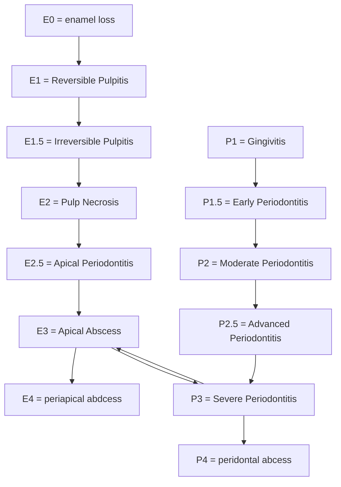

You're laying the groundwork for a very rich diagnostic reasoning model in dentistry that transitions through layers of abstraction:

1. Lattices – Representing structured stages of disease progression.

2. Causal chains – Showing the direction and nature of pathological progression (like from enamel loss to periapical abscess).

3. Markov chains – Capturing probabilistic transitions between disease states.

4. Fuzzy logic – Mapping imprecise clinical signs/symptoms to possible conditions.

5. Signs and symptoms mapping – Associating observable or reported findings to states in the lattice.

---

Let's break it down using your diagram:

1. Lattices

Your Mermaid graph is essentially a Hasse diagram representing partial ordering of disease states. Nodes like E0 to E4 form one branch (endo), and P1 to P4 form another (perio), with shared nodes (e.g., P3 and E3).

2. Causal Chains

Each arrow A --> B implies a cause-effect or progression pathway.

3. Markov Chains

You can now assign probabilities to each transition to build a stochastic model:

E.g., P(E1.5 | E1) = 0.6 (60% chance reversible pulpitis progresses to irreversible pulpitis).

4. Fuzzy Logic

Symptoms like "dull pain", "swelling", "bleeding gums", etc., may not exactly match a stage but fuzzily suggest one.

"Pain" may partially belong to both E1.5 and E2.

"Bleeding" may belong to P1.5 with 0.4 and to P2 with 0.6.

5. Signs and Symptoms Mapping

Create a fuzzy rule base like:

IF pain AND no swelling THEN E1.5 (0.7), P1.5 (0.3)
IF pain AND swelling THEN E3 (0.8), P3 (0.6)

This could be codified in tables or fuzzy inference engines.

---

Would you like:

A Mermaid-based fuzzy inference diagram?

A table showing signs/symptoms with fuzzy scores to stages?

A Python/JS script simulating the Markov/fuzzy transitions?

Let me know how you'd like to build or visualize the next layer.

***

To represent this model mathematically and in natural language, let's break it down step-by-step, covering the elements of lattices, causal chains, Markov chains, fuzzy logic, and signs & symptoms mapping.

1. Lattices: Mathematical Representation

A lattice is a partially ordered set (poset) where every two elements have a unique least upper bound (join) and greatest lower bound (meet). In this case, the nodes represent stages of disease progression, and the arrows represent the order of progression.

Let  be the set of all disease states:

D = \{E0, E1, E1.5, E2, E2.5, E3, E4, P1, P1.5, P2, P2.5, P3, P4\}

Define the ordering between disease states (e.g., E0 < E1 < E1.5 < E2 < E2.5 < E3 < E4, etc.).

The lattice structure is represented by the partially ordered set:

(D, \leq)

2. Causal Chains: Natural Language and Mathematical Representation

Each disease state progression can be represented as a causal chain. A causal chain shows the deterministic or probabilistic relationship between stages.

Natural Language: "Enamel loss (E0) causes Reversible Pulpitis (E1), which can progress to Irreversible Pulpitis (E1.5), leading to Pulp Necrosis (E2), and so on."

Mathematical Representation: Using functions, we can write causal relations:

E1 = f(E0) \quad \text{(Enamel loss causes Reversible Pulpitis)}

E1.5 = f(E1) \quad \text{(Reversible Pulpitis progresses to Irreversible Pulpitis)} ]

Where  is a function that returns the next stage based on the current stage.

3. Markov Chains: Mathematical Representation

A Markov chain is a stochastic process where the probability of moving to the next state depends only on the current state, not on the sequence of events that preceded it.

State Space:

S = \{E0, E1, E1.5, E2, E2.5, E3, E4, P1, P1.5, P2, P2.5, P3, P4\}

Transition Matrix: This matrix contains the probabilities of transitioning from one state to another.

P = \begin{bmatrix}
  P(E0 \to E1) & P(E0 \to E1.5) & \cdots \\
  P(E1 \to E2) & P(E1 \to E1.5) & \cdots \\
  \vdots & \vdots & \ddots
  \end{bmatrix}

Example: Suppose the probability of transitioning from Reversible Pulpitis (E1) to Irreversible Pulpitis (E1.5) is 0.6, and to Pulp Necrosis (E2) is 0.4.

P(E1 \to E1.5) = 0.6, \quad P(E1 \to E2) = 0.4

The Markov process is memoryless:

P(E_{i+1} | E_i, E_{i-1}, \dots, E_0) = P(E_{i+1} | E_i)

Where  is the probability of transitioning to the next state given the current state.

4. Fuzzy Logic: Mathematical Representation

Fuzzy logic can represent the uncertainty and imprecision in mapping symptoms to disease states.

Fuzzy Set: Each disease state can be a fuzzy set, with membership functions that quantify how likely a symptom is associated with a particular disease state.

Membership Function: For a symptom like "pain," the membership function  could look like this:

\mu_{\text{pain}}(E1.5) = 0.7, \quad \mu_{\text{pain}}(E2) = 0.2

Fuzzy Rule Base:

\text{IF pain AND swelling THEN E3 = 0.8, P3 = 0.6}

Where:

 means the disease state of E3 (Apical Abscess) is 80% likely.

 means the disease state of P3 (Severe Periodontitis) is 60% likely.

Fuzzy Inference: After applying fuzzy rules, a defuzzification process gives crisp results. For example:

\text{Defuzzify}(E3, P3) = 0.7 \quad \text{(apical abscess is the most likely condition with 70% confidence)}

5. Signs and Symptoms Mapping: Natural Language and Mathematical Representation

Symptoms can be mapped to disease states using fuzzy logic or predefined mappings.

Natural Language: "Pain can be a symptom of both Irreversible Pulpitis (E1.5) and Pulp Necrosis (E2), but the severity of the pain will influence which stage is more likely."

Mathematical Representation: A symptom  is mapped to a disease state  with a membership value:

\mu_{\text{symptom}}(E_i) \quad \text{for each disease stage}

\mu_{\text{sharp pain}}(E1.5) = 0.9, \quad \mu_{\text{sharp pain}}(E2) = 0.1

---

Summary: Natural Language Representation

1. Lattices: A set of disease stages, each representing a particular condition in the progression of a dental lesion (e.g., enamel loss to apical abscess). These stages are partially ordered.

2. Causal Chains: Disease states progress deterministically or probabilistically. For example, enamel loss (E0) leads to reversible pulpitis (E1), which can progress to irreversible pulpitis (E1.5).

3. Markov Chains: The disease progression follows a memoryless process. The probability of transitioning from one disease state to another is given by a transition matrix.

4. Fuzzy Logic: Symptoms like pain, swelling, or bleeding gums are not perfectly mapped to disease stages. Instead, they have fuzzy membership values (e.g., 70% to E1.5 and 20% to E2 for pain).

5. Signs and Symptoms Mapping: Symptoms are mapped to disease states with fuzzy membership values, which can be used in diagnostic systems to suggest likely conditions.

---

This framework blends mathematical models (lattices, Markov chains, fuzzy logic) with natural language to explain disease progression and symptom-based diagnosis. Would you like to dive deeper into any of these aspects?

***

To fully represent your multi-layered diagnostic reasoning model in Mermaid, we can extend your existing graph by layering additional logic and annotations. Here’s how we can incorporate Steps 4 to 8 into your diagram while keeping it modular and readable.

---

Extended Mermaid Representation (Steps 4–8)
graph TD;
    %% === Disease Progression Lattice (Step 1 + 2) ===
    E0[Enamel Loss (E0)] --> E1[Reversible Pulpitis (E1)]
    E1 --> E1_5[Irreversible Pulpitis (E1.5)]
    E1_5 --> E2[Pulp Necrosis (E2)]
    E2 --> E2_5[Apical Periodontitis (E2.5)]
    E2_5 --> E3[Apical Abscess (E3)]
    E3 --> E4[Periapical Abscess (E4)]
    E3 --> P3

    P1[Gingivitis (P1)] --> P1_5[Early Periodontitis (P1.5)]
    P1_5 --> P2[Moderate Periodontitis (P2)]
    P2 --> P2_5[Advanced Periodontitis (P2.5)]
    P2_5 --> P3[Severe Periodontitis (P3)]
    P3 --> P4[Periodontal Abscess (P4)]
    P3 --> E3

    %% === Step 4: Homeostasis Control System Annotations ===
    subgraph Homeostasis Control System
        HC1[Enamel Shield System Disturbance: Acid, Bacteria Output: Sensitivity Therapeutic: Remineralization]
        HC2[Pulp Core Sentinel Disturbance: Infection Output: Pain, Swelling Therapeutic: Endo Therapy]
        HC3[PDL Suspension System Disturbance: Occlusal Trauma Output: Tooth Mobility Therapeutic: Splinting]
    end
    HC1 --> E0
    HC2 --> E1
    HC3 --> P2

    %% === Step 5: Causal Chains ===
    CC1[Enamel Breakdown] --> E0
    E0 --> CC2[Pulpal Invasion]
    CC2 --> E1_5
    E1_5 --> CC3[Necrosis]
    CC3 --> E2_5
    P2 --> CC4[PDL Collapse]
    CC4 --> P3

    %% === Step 6: Markov Probabilities (Labels only) ===
    E1 -->|60%| E1_5
    E1 -->|40%| E0
    E1_5 -->|80%| E2

    %% === Step 7: Fuzzy Weights ===
    subgraph Fuzzy Logic Weights
        F1[Pain → E1.5 (0.7), E2 (0.3)]
        F2[Swelling → E3 (0.6), P3 (0.4)]
        F3[Bleeding → P1.5 (0.4), P2 (0.6)]
    end

    %% === Step 8: Symptom Mapping ===
    subgraph Clinical Signs/Symptoms
        S1[Pain]
        S2[Swelling]
        S3[Bleeding Gums]
        S4[Mobility]
    end
    S1 --> F1
    S2 --> F2
    S3 --> F3

Explanation

Step 4 (Control Systems): Mapped as blocks linked to early disease nodes (like E0, E1) to represent feedback control logic.

Step 5 (Causal Chains): Shown as sequential logical blocks between transitions.

Step 6 (Markov Chains): Probabilistic transitions added as labels on arrows.

Step 7 (Fuzzy Logic): Subgraph contains fuzzy associations from symptoms to likely states with weights.

Step 8 (Symptom Mapping): External symptom nodes map to fuzzy logic modules.

---

Would you like this in a separate modular Mermaid diagram for each step to keep it visually clearer for a presentation or software rendering?

