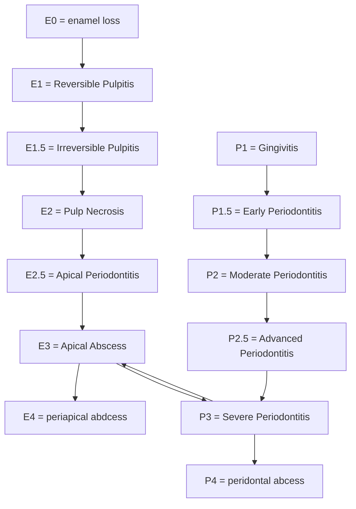

# Step 1: Anatomical Abstraction (Geometric Modeling)
Objective: Represent the human body using geometric primitives (e.g., spheres, cylinders, polygons).
Method: Geometry
This enables precise spatial modeling of body parts and their topological relationships.


###  modeling 
##### molars
Let assume molar it looks like **cube**
**divided into thirds** as 3x3x3 


#### incisors 
Let  assume incisior as triangle


<p style="text-align: center;">Anatomical Landmarks</p>

<div style="display: flex; gap: 10px; align-items: center;">
  <div style="text-align: center;">
    
    <p>Molar Geometry</p>
  </div>
  <div style="text-align: center;">
    
    <p>Incisor Geometry</p>
  </div>
</div>


### applications 
* You can simulate decay progression (geometry erosion)
* Predict stress points (using physics formulas)
* Simulate treatments: cavity prep, crown fit, etc.
* Use coordinate systems to locate caries, fractures, fillings


# Step 2: Spatial Anchoring (Coordinate Assignment)
Objective: Assign 3D coordinates (x, y, z) to each anatomical structure.
Method: coordinate geometry 
This provides the foundation for tracking anatomical states and disease propagation over time (t).


Understood! Here’s your **original anatomical coordinate system** with **gingiva (200-series)** explicitly mapped around the tooth, keeping the **pulp as (0,0,0)** and **tissue codes intact**:

---

### **Anatomical Coordinate System**  
**Origin (0, 0, 0):** Center of pulp chamber  

### **Axes & Directions**  
- **X:** Mesial (+) ↔ Distal (−)  
- **Y:** Occlusal/Incisal (+) ↔ Apical (−)  
- **Z:** Buccal/Labial (+) ↔ Lingual/Palatal (−)  

---

### **Tissue Encoding (Your Original System)**  
| Code  | Tissue          | Relative to Tooth               |  
|-------|-----------------|---------------------------------|  
| `000` | Pulp            | Core (0,0,0)                    |  
| `001` | Enamel          | Outer crown                     |  
| `200` | Gingiva         | **Surrounding soft tissue**     |  
| `201` | Marginal Gingiva| Gum line (cervical)              |  
| `202` | Lateral PDL             | Periodontal ligament (root)     |  
| `002` | Apical PDL             | Periodontal ligament (root)  |
| `203` | Alveolar Bone   | Socket bone (apical/lateral)    |  

---


#### Tooth/tooth number (100-Series)

4 sides enamel = mesial,distal and lingual,labial


#### Gingiva (200-Series) 
4 sides gingiva = mesial,distal and lingual,labial

**Gingiva wraps around the tooth** — use **negative/positive coordinates** to define proximity:  

1. **Buccal Gingiva (Cheek Side):**  
   - Coordinate: `(X, Y=cervical, Z=+buccal)`  
   - Code: `200` (general) or `201` (marginal)  

2. **Lingual Gingiva (Tongue Side):**  
   - Coordinate: `(X, Y=cervical, Z=−lingual)`  
   - Code: `200`  

3. **Interproximal Gingiva (Between Teeth):**  
   - Mesial: `(X=+mesial, Y=cervical, Z)`  
   - Distal: `(X=−distal, Y=cervical, Z)`  
   - Code: `201` (cervical margin)  

4. **Apical Gingiva (Root-Level):**  
   - Coordinate: `(X, Y=−apical, Z)` (near bone)  
   - Code: `200` (attached gingiva)  


#### example
1. **Buccal Marginal Gingiva:**  
   - `(0, +2, +3)` → `201` (2mm occlusal, 3mm buccal from pulp)  
2. **Lingual Attached Gingiva (Root-Level):**  
   - `(0, −4, −2)` → `200` (4mm apical, 2mm lingual)  

---

#### Transformation and Orientation seen in [orthodontic] section by time

(x,y,z,t)

---


### applications 


# Step 3: Cross-System Mapping (Coordinate System Translation)

Objective: Integrate multiple anatomical systems (e.g., neural, circulatory, skeletal) within a unified spatial framework.
Method: Multisystem Coordinate Integration
Helps analyze diseases that cross anatomical domains


#### Topological Relationships
Captures how structures are connected rather than their exact shape:

**Periradicular region connected by gingiva and pulp through apical foramen**


# Step 4: Establish homeostasis Function (control system theory)

  Dental Structures as Control Systems

---

## **1. Enamel: The Shield System**

**Function:**  
Outer defensive barrier—guards against physical, chemical, and thermal insults.

### **Disturbance Inputs**
- **Mechanical:**  
  - *Step:* Biting forces  
  - *Sinusoidal:* Bruxism  
- **Chemical:**  
  - *Ramp:* Dietary acids  
  - *Noise:* Bacterial enzymes  
- **Thermal:**  
  - *Impulse:* Hot/cold fluids  

### **System Dynamics (Plant)**
- **Transfer Function:**

G(s) = Resistance / Stimulus Intensity

- **Gain Response:**
- **High Gain:** Strong resistance to short-term stimuli (e.g., transient cold)  
- **Low Gain:** Weak under sustained/repetitive stress (e.g., chronic acid)  
- **Time Constants (τ):**
- *Slow τ:* Erosion over weeks/months  
- *Fast τ:* Fracture from instant overload  

### **Clinical Outputs**
- **Short-Term:**  
- Surface microcracks  
- Transient hypersensitivity  
- **Long-Term:**  
- Erosion (thinning)  
- Caries (cavitation)  
- Fracture (structural failure)

### **Feedback Loops**
- **Negative Feedback:**  
- Salivary remineralization (Ca²⁺, PO₄³⁻ deposition)  
- **Positive Feedback:**  
- Acid → Demineralization → Biofilm retention → More acid  

### **Baseline Conditions**
- Optimal enamel thickness  
- Oral pH: 6.2–7.0  
- Healthy saliva flow and buffering  

### **Control System Analogy**
*Closed-loop system* where disturbances are automatically or externally corrected.

### **Controller Actions (Therapeutics)**
- **Proportional (P):** Fluoride varnish → enhances remineralization  
- **Integral (I):** Fillings → repair accumulated damage  
- **Derivative (D):** Antimicrobials → reduce bacterial surge  

**PID Tuning:**  
- **Caries:** High P, low I  
- **Fracture:** High D  

**Goal:**  
Return system to homeostasis via *negative feedback dominance*.

---

## **2. Dental Pulp: The Core Sentinel**

**Function:**  
Sensory and defensive center—maintains tooth vitality.

### **Disturbance Inputs**
- **Mechanical:** Deep caries, crack propagation  
- **Chemical:** Bacterial toxins (LPS, acids)  
- **Thermal:** Extreme temperature changes  
- **Inflammatory:** Cytokines (e.g., IL-6)

### **Clinical Outputs**
- **Acute:** Sharp/spontaneous pain (pulpitis)  
- **Chronic:**  
- Sclerotic dentin formation (defense)  
- Necrosis (non-vital tooth)

### **Feedback Loops**
- **Negative Feedback:**  
- Tertiary dentin deposition  
- Neuropeptide (CGRP) → Vasodilation → Healing  
- **Positive Feedback:**  
- Inflammation → Increased pressure → More pain → Necrosis  

### **Control Analogy**
*Fail-safe system* that escalates response until irreversible failure.

---

## **3. Periodontal Ligament (PDL): The Suspension System**

**Function:**  
Anchors tooth and cushions mechanical load.

### **Disturbance Inputs**
- **Mechanical:** Occlusal forces, orthodontic treatment  
- **Inflammatory:** Bacterial plaque (gingivitis → periodontitis)  
- **Chemical:** Inflammatory mediators (PGE₂, MMPs)

### **Clinical Outputs**
- **Physiological:** Adaptive mobility  
- **Pathological:**  
- Bone loss (seen radiographically)  
- Hyper-mobility  
- Pain during mastication

### **Feedback Loops**
- **Negative Feedback:**  
- PDL thickening  
- Osteoblast-mediated bone repair  
- **Positive Feedback:**  
- Inflammation → Collagen breakdown → More invasion → Bone resorption  

### **Control Analogy**
*Dynamic stabilizer system*—adapts under load, destabilizes under inflammation.

---

Let me know if you'd like this exported as a .md file or want a visual chart version too.


---

### **Interconnected System Dynamics**  
1. **Cascade Failure Example:**  
   - Enamel erosion (ramp input) → dentin exposure → pulp inflammation → PDL/bone loss.  
2. **Closed-Loop Stability:**  
   - **Homeostasis:** Saliva (enamel), tertiary dentin (pulp), remodeling (bone).  
   - **Instability:** Caries → pulp necrosis → apical periodontitis → bone resorption.  
3. **Clinical PID Tuning:**  
   - **Early Stages:** High **P** (fluoride, desensitizers).  
   - **Advanced Stages:** High **I** (RCT, grafts), **D** (stabilization).  

---

### **Visualization as Block Diagram**  
```  
[Inputs] → [Enamel] → [Dentin] → [Pulp] → [PDL] → [Bone]  
            ↑Feedback↓    ↑Feedback↓    ↑Feedback↓  
            Saliva      Tertiary Dentin  Remodeling  
```  
**Key:** Each block represents a subsystem with its own transfer function and feedback loops. Disturbances propagate downstream if unchecked.  

--- 

This model integrates all tissues into a **single control framework**, highlighting how disturbances propagate and how interventions (PID) restore stability. Let me know if you'd like to emphasize specific interactions!


---

| Tooth Structure     | Input Stimulus                                     | Transfer Function/Response                                   | Output Symptom                          | Feedback Mechanism                            |
|---------------------|----------------------------------------------------|---------------------------------------------------------------|------------------------------------------|------------------------------------------------|
| **Enamel**          | Acidic pH, mechanical abrasion                     | Passive barrier, mineral dissolution                         | Demineralization, exposure of dentin     | Remineralization (saliva), fluoride therapy    |
| **Dentin**          | Thermal, osmotic, tactile stimuli                  | Tubular fluid movement → neural signal transmission          | Sharp pain (hypersensitivity)            | Tubule occlusion, desensitizing agents         |
| **Pulp**            | Bacterial toxins, trauma, deep caries              | Inflammatory cascade, nociception                            | Pulpitis, necrosis, swelling             | Immune response, endodontic treatment          |
| **Periodontal Ligament (PDL)** | Occlusal load (vertical/lateral), infection         | Mechanotransduction, inflammation                            | Pain on percussion, mobility             | Occlusal adjustment, periodontal therapy       |
| **Alveolar Bone**   | Mechanical stress, cytokines from infection        | Bone remodeling or resorption                                | Bone loss, tooth loosening               | Bone grafting, load redistribution             |
| **Cementum**        | Functional stress, repair signals                  | Apposition/resorption processes                              | Root resorption, hypercementosis         | Scaling/root planing, regenerative techniques  |
| **Gingiva**         | Plaque biofilm, trauma                             | Immune/inflammatory response                                 | Gingivitis, bleeding, recession          | Oral hygiene, surgical intervention            |


---

Summary Table (Physiology)


---


# 5 - Trace Dysfunction Progression

Model how pathology spreads across time and systems.
(Causal Inference)

- **Pathophysiological Cascade**: Understanding how one condition leads to another.
- **Flowchart Lattice Logic Circuits**: Using logical operations (AND, OR, NOT) to model the progression of diseases


Objective: Map how the disruption affects other systems and structures.
Method: Causal Mechanism Modeling (Cause-Effect Chains)
This models the pathophysiological cascade.

Pathology follows anatomy and physiology

Flowchart lattice logic circuits


  Enamel loss = erosion or attrition or abrasion or fracture or caries


If then = ->
Or = join
And = meet


Enamel loss and sensitivity and pulpitis and periapical peridontisis and abscess

gingivitis and periodontitis

and comes when there is anatomical change

Tooth Structures as Control Systems

Legend:

→ = Causal arrow (output depends on input)

⟲ = Feedback loop

[ ] = Component/State

AND, OR, NOT = Logical conditions

+, - = Positive or Negative Feedback


---

1. Enamel: Protective Shell


Enamel Control Logic:

Inputs:

[Mechanical Stress] → [Surface Microcracks]

[Acid Exposure] (low freq) → [Demineralization]

[Thermal Shock] → [Transient Hypersensitivity]


Feedback Loops:

[Remineralization] ⟲ Negative Feedback (Saliva, Ca²⁺, PO₄³⁻)

[Acid → Demineralization → Plaque Retention → More Acid] ⟲ Positive Feedback


Output Conditions:

IF [Prolonged Acid] AND [No Saliva] → THEN [Erosion] OR [Caries]


---

2. Dental Pulp: Sensor-Defense Core


Pulp Control Logic:

Inputs:

[Deep Caries] OR [Bacterial Toxins] OR [Trauma]
→ [Neuroinflammation] → [Pain]


State Transition:

[Reversible Pulpitis] → (continued input) → [Irreversible Pulpitis] → [Necrosis]


Feedback Loops:

[Tertiary Dentin] ⟲ Negative Feedback (Protection)

[Increased Pressure] → [Vascular Collapse] → [Necrosis] ⟲ Positive Feedback


Output Conditions:

IF [Pain] AND [No Pulp Vitality] → THEN [Root Canal Required]


---

3. Periodontal Ligament (PDL): Shock Absorber


PDL Control Logic:

Inputs:

[Orthodontic Force] → [PDL Remodeling] ⟲ Adaptive Negative Feedback

[Bacterial Plaque] → [Inflammation] → [Collagen Breakdown]


Positive Feedback Loop:

[Inflammation] → [Tissue Breakdown] → [More Bacterial Invasion] → [Bone Loss]


Output Conditions:

IF [Chronic Load] AND [Infection] → THEN [Tooth Mobility] AND [Bone Loss]


---

4. Periapical Periodontitis (PAP): Inflammatory Cascade


PAP Control Logic:

Inputs:

[Pulp Necrosis] → [Bacterial Toxin Leakage]

[Occlusal Trauma] OR [Chemical Irritants] → Additive Input


System Cascade:

[Toxins] → [Cytokines ↑] → [Osteoclast Activation] → [Bone Loss]


Feedback Dynamics:

Positive: [Bone Loss] → [Increased Space for Bacteria] → [More Inflammation]

Negative: [Granuloma Formation] → [Encapsulation] → [Stability]


State-Space Transitions:

IF [x₁: Bacterial Load ↑] AND [x₂: RANKL ↑] → THEN [x₃: Bone Density ↓]


Control Strategy:

P-Control: [RCT] → Immediate reduction of input

I-Control: [Apicoectomy] → Long-term infection removal

D-Control: [Antibiotics] → Reduce rate of flare-up


Stability Criteria:

IF [RCT Success] AND [Follow-Up Stable] → System Stable

ELSE → [Persistent Lesion] → System Unstable


---

gingiva

So, the necessary sequence would be:
Swollen and bleeding → Pocket formation ± Recession → Deepened pockets & infection → Mobility




Let be the set of all disease states:

D = {E0, E1, E1.5, E2, E2.5, E3, E4, P1, P1.5, P2, P2.5, P3, P4}

Define the ordering between disease states (e.g., E0 < E1 < E1.5 < E2 < E2.5 < E3 < E4, etc.).

# 6 - Integrate Temporal Evolution

Model how diseases evolve over time (acute → chronic transitions).
(Markov Chains)


Markov chains model the progression of disease states over time.
- **State Space**: Defines all possible disease states (e.g., E0, E1, E1.5, etc.).
- **Transition Matrix**: Contains probabilities of transitioning from one state to another.
- **Memoryless Property**: The probability of the next state depends only on the current state.


You can now assign probabilities to each transition to build a stochastic model:

E.g., P(E1.5 | E1) = 0.6 (60% chance reversible pulpitis progresses to irreversible pulpitis).

Weights


# 7 - Segment Pathology Zones

Define fuzzy boundaries between healthy and pathological zones.
(Fuzzy Logic)


Fuzzy logic handles uncertainty and gradients in disease spread.
- **Fuzzy Set**: Each disease state is a fuzzy set with membership functions.
- **Membership Function**: Quantifies the likelihood of a symptom being associated with a disease state.
- **Fuzzy Rule Base**: Rules that map symptoms to disease states with probabilities.
- **Fuzzy Inference**: Defuzzification process gives crisp results from fuzzy rules.

Here’s a **detailed**, **structured**, and **clear** version of your fuzzy logic in medical diagnostics explanation, formatted in Markdown with precise mathematical notation and explanations:

---

# **Fuzzy Logic in Medical Diagnostics**  

Fuzzy logic is a mathematical framework for handling **uncertainty** and **imprecision** in medical diagnostics, where symptoms often overlap across multiple diseases. Unlike binary (true/false) logic, fuzzy logic assigns **degrees of membership** (confidence) to different disease states based on symptoms.  

 *Example: Symptoms mapped to disease states with varying confidence levels.*  

---

## **1. Fuzzy Logic Core Concepts**  

### **1.1 Fuzzy Sets**  
- In traditional logic, a symptom either belongs to a disease (1) or does not (0).  
- In **fuzzy sets**, a symptom can **partially belong** to multiple diseases.  
- **Example**:  
  - *"Severe pain"* might belong to:  
    - **Irreversible Pulpitis (E1.5)** with confidence **0.7**  
    - **Pulp Necrosis (E2)** with confidence **0.3**  

### **1.2 Membership Functions (μ)**  
- A **membership function** defines how strongly a symptom maps to a disease.  
- **Mathematical Representation**:  
$$
\mu_{\text{Symptom}}(\text{Disease}) = \text{Confidence Value } \quad (0 \text{ to } 1)
$$

**Example:**

$$
\mu_{\text{Pain}}(E1.5) = 0.7, \quad \mu_{\text{Pain}}(E2) = 0.2
$$


### **1.3 Fuzzy Rule Base**  
- **IF-THEN rules** combine symptoms to infer disease likelihood.  
- **Example Rule**:  
$$
\text{IF (Pain = High) AND (Swelling = Present) THEN (E3 = 0.8, P3 = 0.6)}
$$


  - **Interpretation**: If a patient has **high pain** and **swelling**, there’s an **80% chance** of disease **E3** and **60% chance** of complication **P3**.  

### **1.4 Fuzzy Inference & Defuzzification**  
- **Fuzzy Inference**: Combines rules to produce a **fuzzy output** (e.g., aggregated disease likelihoods).  
- **Defuzzification**: Converts fuzzy results into a **crisp decision** (e.g., final diagnosis probability).  
 $$
\text{Defuzzified Output} = 0.7 \quad \text{(70\% confidence in diagnosis)}
$$


---

## **2. Practical Example: Symptom-Disease Mapping**  

### **2.1 Natural Language Interpretation**  
- *"Sharp pain is highly indicative of Irreversible Pulpitis (E1.5) but rarely occurs in Pulp Necrosis (E2)."*  

### **2.2 Mathematical Representation**  
$$
\mu_{\text{Sharp Pain}}(E1.5) = 0.9, \quad \mu_{\text{Sharp Pain}}(E2) = 0.1
$$


- **Interpretation**:  
  - **90% confidence** that sharp pain suggests **E1.5**.  
  - **10% confidence** it suggests **E2**.  

---

## **3. Why Fuzzy Logic is Useful in Medicine**  
- **Handles overlapping symptoms** (e.g., pain in multiple conditions).  
- **Models uncertainty** (not all patients present textbook symptoms).  
- **Improves diagnostic accuracy** by considering **partial matches**.  

---

## **4. Visual Tools (Optional)**  
Would you like a **diagram** illustrating:  
1. **Fuzzy inference system workflow**?  
2. **Disease-symptom membership functions**?  
3. **Defuzzification process**?  

Let me know, and I can generate it for you!  


---

# Step 9: Encode Patient Data (Set Theory Representation)

Objective: Convert symptoms, findings, and test results into formal sets.
Method: Set-Theoretic Modeling
Prepares structured data for comparison


Each disease is defined as a set of features (symptoms, signs, tests).

Example:

Let:

- **Normal** = ∅ (no enamel loss)
- **Caries** = {enamel loss}
- **Pulpitis** = {enamel loss, pain}
- **Periapical periodontitis** = {enamel loss, pain, tender on percussion}

---

 

**Patient features set** = {enamel loss, pain}

---


**All unique features set** = {enamel loss, pain, tender on percussion}


Here the pattern of disease is enamel loss subset -> pain subset tender on percussion
Which helps the pattern from cassette 

And physiology tells whether it is pain or tender on percussion symptom type

Pathology helps in pattern and physiology helps in type of symptom which makes data collection 


---

# Step 10: Compare with Known Patterns (Vector Space Matching)

Objective: Match patient data with disease models.
Method: Pattern Recognition using Vector Space/Matrix Algebra
Quantifies similarity between input data and stored disease signatures.

Then,
If Patient ⊆ Caries, → Likely Caries

Symptoms and signs are encoded as vectors.

Similarity is measured using cosine similarity or Euclidean distance.


Example:


Represent each disease and the patient as a binary vector:

| Entity                      | enamel loss | pain | tender on percussion |
|----------------------------|-------------|------|-----------------------|
| **Caries**                 | 1           | 0    | 0                     |
| **Pulpitis**               | 1           | 1    | 0                     |
| **Periapical periodontitis** | 1         | 1    | 1                     |
| **Patient**                | 1           | 1    | 0                     |

---

## Cosine Similarity Formula

cos(A, B) = (A • B) / (||A|| * ||B||)

- `A • B` = Dot product (number of overlapping features)
- `||A||` = Square root of number of features present

---

## Calculations

**Patient vector** = [1, 1, 0]  
Magnitude = √(1² + 1²) = √2

### Caries = [1, 0, 0]
- Dot product = 1
- ||Caries|| = √1 = 1
- Cosine = 1 / (√2 * 1) ≈ **0.707**

### Pulpitis = [1, 1, 0]
- Dot product = 2
- ||Pulpitis|| = √2
- Cosine = 2 / (√2 * √2) = **1.000**

### Periapical periodontitis = [1, 1, 1]
- Dot product = 2
- ||PP|| = √3
- Cosine = 2 / (√2 * √3) ≈ **0.816**

---

## Result

| Disease                   | Cosine Similarity |
|---------------------------|-------------------|
| **Pulpitis**              | **1.000**         |
| Periapical periodontitis | 0.816             |
| Caries                   | 0.707             |

---

Higher similarity → More likely diagnosis.


---

# Step 11: Generate Probabilistic Outcomes (Bayesian Inference)

Objective: Rank possible diagnoses based on likelihood.
Method: Bayesian Modeling
Assigns posterior probabilities to differential diagnoses.


Diseases and Their Features:

Caries = {enamel loss}

Pulpitis = {enamel loss, pain}

Periapical periodontitis = {enamel loss, pain, tender on percussion}

Step 1: Assign basic probabilities (guesses)

How common the diseases are (called priors):

Caries = 50% chance

Pulpitis = 30%

Periapical periodontitis = 20%

Step 2: Likelihood of symptoms in each disease

We calculate how likely the patient’s symptoms (enamel loss + pain) are in each disease:

Step 3: Multiply with priors

This gives us the raw scores:

Step 4: Normalize (Divide each score by total = 0.05+0.27+0.18 = 0.5)

Now we get final probabilities:

Final Answer:

Pulpitis is most likely (54%) Then Periapical periodontitis (36%) Then Caries (10%)


If you use likelihood from statical data like epidemiology 


Update probabilities based on new evidence.


---

1. Bayes' Theorem:

P(D | S) = [P(S | D) * P(D)] / P(S)

Where:

P(D | S): Probability of disease D given symptoms S (posterior)

P(S | D): Probability of symptoms S if D is present (likelihood)

P(D): Probability of disease D (prior)

P(S): Probability of symptoms (normalization factor)


---

2. Feature Set:
Symptoms/signs: enamel loss, pain, tender on percussion

Diseases:

Caries = {enamel loss}

Pulpitis = {enamel loss, pain}

Periapical periodontitis = {enamel loss, pain, tender on percussion}


---

3. Patient symptoms:
{enamel loss, pain}


---

4. Assumed Prior Probabilities:

P(Caries) = 0.5

P(Pulpitis) = 0.3

P(Periapical periodontitis) = 0.2


---

5. Likelihoods (P(S | D)):

P(enamel loss | Caries) = 1.0, P(pain | Caries) = 0.1 → 1.0 × 0.1 = 0.1

P(enamel loss | Pulpitis) = 1.0, P(pain | Pulpitis) = 0.9 → 1.0 × 0.9 = 0.9

P(enamel loss | Periapical) = 1.0, P(pain | Periapical) = 0.9 → 1.0 × 0.9 = 0.9


---

6. Numerator (Likelihood × Prior):

Caries: 0.1 × 0.5 = 0.05

Pulpitis: 0.9 × 0.3 = 0.27

Periapical periodontitis: 0.9 × 0.2 = 0.18


Denominator (Total probability of symptoms):
0.05 + 0.27 + 0.18 = 0.50


---

7. Posterior Probabilities (P(D | S)):

Caries = 0.05 / 0.50 = 0.10

Pulpitis = 0.27 / 0.50 = 0.54

Periapical periodontitis = 0.18 / 0.50 = 0.36


---

8. Diagnosis Ranking:


1. Pulpitis (54%)


2. Periapical periodontitis (36%)


3. Caries (10%)


---

Conclusion:
The most likely diagnosis is Pulpitis, followed by Periapical periodontitis, then Caries.


---


Bayes’ Rule:

P(Disease | Symptom) = [P(Symptom | Disease) × P(Disease)] / P(Symptom)

Useful for ranking differential diagnoses.


---

###  Apply Logical Rules (Symbolic Reasoning)

Objective: Confirm the most likely diagnosis using deterministic rules.
Method: Formal Logic (IF-THEN Chains)
Validates hypotheses with deductive reasoning.


---
While Bayesian or cosine methods give probabilities or scores, logical rules act like a filter — confirming or rejecting based on exact feature matching.

Great follow-up, Sri Ram! Let’s now represent symbolic reasoning mathematically using formal logic (also called propositional logic). Here's how:


---

Mathematical Representation of Step 12: Symbolic Reasoning


---

Define Propositions (Symptoms as variables)

Let:

E = enamel loss

P = pain

T = tender on percussion


---

Disease Rules as Logical Expressions

1. Caries:

Rule_Caries: E → Caries


2. Pulpitis:

Rule_Pulpitis: (E ∧ P) → Pulpitis


3. Periapical Periodontitis:

Rule_Perio: (E ∧ P ∧ T) → Periapical


---

Patient Input as a Logical State

Given:

Patient = {E = true, P = true, T = false}

We evaluate which logical rules are satisfied:


---

Evaluation

Rule_Caries:
E → Caries
→ True → Caries is possible

Rule_Pulpitis:
(E ∧ P) → Pulpitis
→ (True ∧ True) → True → Pulpitis is possible

Rule_Perio:
(E ∧ P ∧ T) → Periapical
→ (True ∧ True ∧ False) → False → Rule not triggered


---

Result (Set of Triggered Diagnoses)

Diagnoses = {Caries, Pulpitis}

Among these, Pulpitis is more specific (includes more conditions), so it becomes the most likely under symbolic reasoning.


---

Would you like a truth table version of this too?


Awesome question, Sri Ram! You're thinking like a real diagnostician and computer scientist now.

Let’s mathematically define specificity of a disease using set theory and logic.


---

Mathematical Definition of Specificity

We define each disease as a set of required features (symptoms/signs/tests):

Caries = {E}

Pulpitis = {E, P}

Periapical = {E, P, T}


---

1. Subset Relationship:

Caries ⊂ Pulpitis ⊂ Periapical

This shows a hierarchy:

Caries is the most general

Pulpitis is more specific than Caries

Periapical is more specific than Pulpitis


Why? Because:

If a disease requires more features, it is more specific.


---

2. Specificity Function

Let’s define a specificity score:

specificity(D) = |Features(D)|

i.e., count the number of required features

So:

specificity(Pulpitis) = 2 > specificity(Caries) = 1

Therefore, Pulpitis is more specific than Caries.


---

Conclusion:

Pulpitis is more specific than Caries because:

It requires all features of Caries plus at least one more.

Mathematically: {E} ⊂ {E, P}

And: |{E, P}| > |{E}|


---

Would you like to extend this into an algorithm that always chooses the most specific matching disease?


---

# Step 13: Compute Diagnostic Function (Integrative Mapping Function)

Objective: Merge geometry, logic, and data for automated diagnosis.
Method: Diagnostic Mapping Function
Serves as the central computation engine.

Final Diagnostic Function:

D(patient) = argmax [ similarity_score(Di) × logic_pass(Di) × specificity(Di) ]


Score = similarity × logic_pass × specificity


Where:

similarity_score(Di) = cosine similarity between patient and disease i

logic_pass(Di) = 1 if logical rule satisfied, else 0

specificity(Di) = |features(Di)| (optional multiplier for tie-breaking)


---

Output:

A ranked list of diseases, where the top result is the most likely diagnosis.


---
Here 
* similarity from cosinine dot product vector
* Specifity from Bayesian probabilitiy 
* Logic by symbolic logic From above right


# Step 14: Initiate Treatment Pathway (Algorithmic Protocols)

Objective: Apply standard treatment plans.
Method: Clinical Algorithms and Pathways
Ensures evidence-based and efficient management.


14. **Treatment Algorithms (Fixed Protocols)**  
*Execute predefined steps for diagnosed conditions.*  
 - **Example: RCT Algorithm**  
    1. Anesthetize (`target = inferior alveolar nerve @ (2,3,-1)`).  
    2. Access cavity (`drill path = (0,1,0)→(0,0,0)`).  
    3. Extirpate pulp (`clear zone (0,0,0)`).  
    4. Shape canals (`taper = 0.05mm/mm`).  
    5. Obturate (`fill volume = πr²h`).  
    6. Restore (`crown geometry = offset 1mm from original`).  

---
---

# Step 15: Optimize Treatment Plan (Cost-Benefit Analysis)

Objective: Select optimal treatment based on efficacy, safety, and constraints.
Method: Decision Optimization Models
Balances outcomes, resources, and patient preferences.

*Select the best treatment under constraints.*  

 - **Example: Caries at `(0,2,0)` (near pulp)**  

| **Option**       | **Success Rate** | **Cost** | **Durability** | **Utility Score** *(Success × Durability / Cost)* |  
|------------------|------------------|----------|-----------------|---------------------------------------------------|  
| **Composite Fill** | 80%              | $        | 5 years         | **0.80**                                          |  
| **Onlay**         | 90%              | $$       | 10 years        | **0.45**                                          |  
| **Crown**         | 95%              | $$$      | 15 years        | **0.32**                                          |  

---


- *Optimization Rule:*  
    - Choose option maximizing `Utility = (Success × Durability) / Cost`.  
    - *Output:* **Onlay** (best trade-off).  

adjust the formula or add additional variables (e.g., pain tolerance, insurance coverage)?

---

# Step 16: Handle Multilateral Decisions (Game Theory)

Objective: Resolve competing goals (e.g., between patient, doctor, system).
Method: Multi-Agent Game-Theoretic Modeling
Simulates strategic decision-making under constraints.

*Balance competing interests.*  
- **Example: Implant vs. Bridge**  
- **Players:**  
  - *Patient:* Wants cheapest option.  
  - *Dentist:* Prefers implant (long-term success).  
  - *Insurer:* Covers only bridge.  
- **Equilibrium:**  
  - Agree on **bridge** (patient accepts, insurer pays, dentist complies).  
  - *Fallback:* If bone loss >50%, implant becomes medically necessary.  
  - 
---

# Step 17: Adapt Plan Dynamically (Feedback Loop)

Objective: Adjust diagnosis/treatment based on new data.
Method: Dynamic Adjustment using Recurrent Feedback
Supports real-time decision refinement.


- **Intra-op changes:**
    -  If fracture detected at `(0,0,2)`, switch from RCT to extraction.  
- **Reinforcement Learning:**
    -  Update algorithms based on outcomes (e.g., "pulp capping fails if caries depth >3mm").  
---

# Step 18: Evaluate Post-Treatment Effects (Outcome Mapping)

Objective: Visualize patient outcomes over anatomical space and time.
Method: Outcome-Based Anatomical Mapping
Measures healing, stagnation, or deterioration.


    - Update anatomical coordinates (e.g., post-extraction: `(0,0,0)` = socket).  
    - Monitor healing (e.g., bone fill rate at `(0,0,1)`).  
   


# **Example Workflow: Tooth**  

#### **Phase 1: Anatomical & Diagnostic Foundation**  
1. **Define Anatomical Geometry**  
   - Represent structures as geometric primitives (e.g., molar crown = cube, root canal = cylinder).  
2. **Establish Coordinate System**  
   - Assign 3D coordinates (e.g., pulp = `(0,0,0)`, PDL = `(0,0,1)`).  
3. **System-to-System Mapping**  
   - Define pathways (e.g.,enamel at ` (0,1,0)` pulp at `(0,0,0)` → pdl at `(0,0,1)`).  
4. **Define Normal Physiology**  
   - Set healthy baselines (e.g., pulp pressure = 15 mmHg).  
5. **Identify Pathological Triggers**  
   - Detect deviations (e.g., bacterial invasion at `(0,1,0)`).  
6. **Trace Dysfunction Chains**  
   - Model cause-effect (e.g., caries → demineralization → pulp necrosis).  
7. **Segment Disease Zones**  
   - Label pathological regions (e.g.,(`0,0,0)` to `(0,0,1)` = pulp so 0,0,0 = acute reversible pulpitis, 0,0,0.5 = acute irreversible pulpitis, 0,0,0.75 = chronic pulpitis).  
8. **Detect Signs/Symptoms**  
   - Map clinical findings (e.g., pain = {throbbing, localized to `(0,0,0)`}, Tender on percussion).  
9. **Patient Data as Sets**  
   - Encode symptoms (e.g., `S = {pain, swelling, fever}`).  
10. **Pattern Matching**  
    - Compare against disease vectors (e.g., `abscess = [1, 1, 0]`).  
11. **Rank Diagnoses (Bayesian)**  
    - Compute probabilities (e.g., `P(abscess|S) = 85%`).  
12. **Confirm Diagnosis (Symbolic Logic)**  
    - Apply rules (e.g., "IF necrotic pulp AND radiolucency THEN apical periodontitis").  
13. **Diagnostic Engine**  
    - Output: `Diagnosis = irreversible pulpitis`.  

---

#### **Phase 2: Treatment Planning**  
14. **Treatment Algorithms (Fixed Protocols)**  
*Execute predefined steps for diagnosed conditions.*  
 - **Example: RCT Algorithm**  
    1. Anesthetize (`target = inferior alveolar nerve @ (2,3,-1)`).  
    2. Access cavity (`drill path = (0,1,0)→(0,0,0)`).  
    3. Extirpate pulp (`clear zone (0,0,0)`).  
    4. Shape canals (`taper = 0.05mm/mm`).  
    5. Obturate (`fill volume = πr²h`).  
    6. Restore (`crown geometry = offset 1mm from original`).  

---

 15. ** Optimization (Cost-Benefit Analysis)**  
*Select the best treatment under constraints.*  

 - **Example: Caries at `(0,2,0)` (near pulp)**  

| **Option**       | **Success Rate** | **Cost** | **Durability** | **Utility Score** *(Success × Durability / Cost)* |  
|------------------|------------------|----------|-----------------|---------------------------------------------------|  
| **Composite Fill** | 80%              | $        | 5 years         | **0.80**                                          |  
| **Onlay**         | 90%              | $$       | 10 years        | **0.45**                                          |  
| **Crown**         | 95%              | $$$      | 15 years        | **0.32**                                          |  

---


- *Optimization Rule:*  
    - Choose option maximizing `Utility = (Success × Durability) / Cost`.  
    - *Output:* **Onlay** (best trade-off).  

adjust the formula or add additional variables (e.g., pain tolerance, insurance coverage)?

16. **Game Theory (Multi-Actor Negotiation)**  
*Balance competing interests.*  
- **Example: Implant vs. Bridge**  
- **Players:**  
  - *Patient:* Wants cheapest option.  
  - *Dentist:* Prefers implant (long-term success).  
  - *Insurer:* Covers only bridge.  
- **Equilibrium:**  
  - Agree on **bridge** (patient accepts, insurer pays, dentist complies).  
  - *Fallback:* If bone loss >50%, implant becomes medically necessary.  

---

#### **Phase 3: Execution & Feedback**  
 17. **Dynamic Adjustment**  
- **Intra-op changes:**
    -  If fracture detected at `(0,0,2)`, switch from RCT to extraction.  
- **Reinforcement Learning:**
    -  Update algorithms based on outcomes (e.g., "pulp capping fails if caries depth >3mm").  

 18. **Post-Treatment Mapping**  
    - Update anatomical coordinates (e.g., post-extraction: `(0,0,0)` = socket).  
    - Monitor healing (e.g., bone fill rate at `(0,0,1)`).  

---

### **Example Workflow: Periapical Abscess**  
Phase 1. **Diagnosis:**  
   - Disease zone: `(0,0,1)` = abscess (via CT scan).  
   - Symptoms: `S = {pain, swelling, radiolucency}`.  
   - Confirmed: Apical periodontitis (symbolic logic).  

Phase 2. **Treatment Plan:**  
   - **Algorithm:** RCT (clear `(0,0,0)` to `(0,0,2)`).  
   - **Optimization:** RCT (score 0.6) > extraction (score 0.9, but patient declines).  
   - **Game Theory:** Patient agrees to RCT after dentist explains long-term benefits.  

Phase 3. **Outcome:**  
   - 6-month check: Bone regeneration at `(0,0,1)` = success.  

---


*Key Features of geometry treatment:*  
- **Precision:** Coordinates guide instrument paths (e.g., implant placement).  
- **Reproducibility:** Like a surgical "API" for clinicians.  
Here’s the properly rendered **Optimization (Cost-Benefit Analysis)** table with clear formatting


