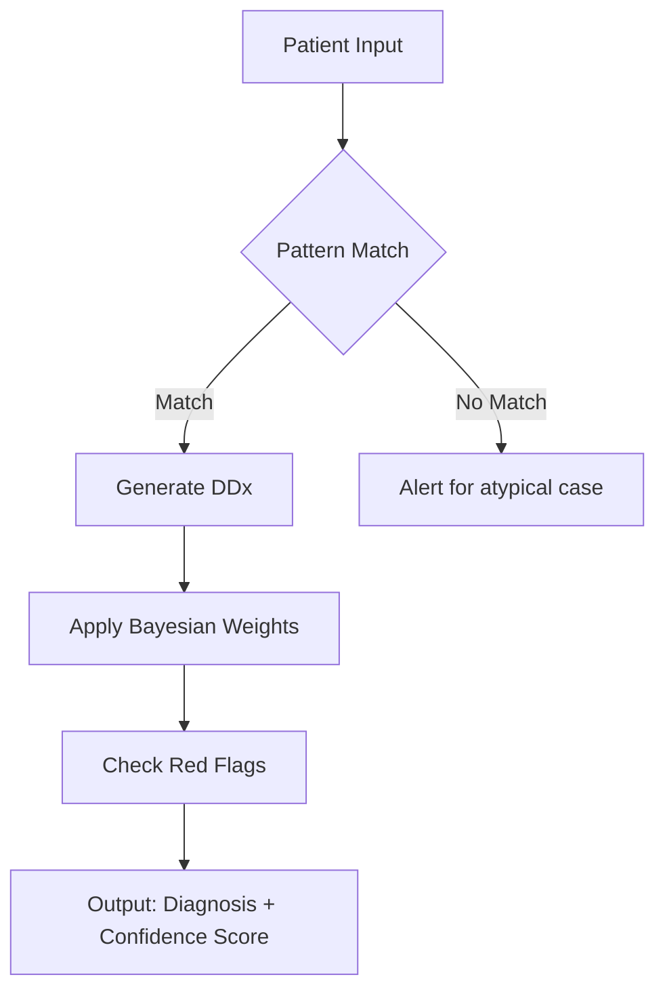

Great! Here’s a clear step-wise structure showing how Physiology → Pathology → Diagnosis works using a unified medical reasoning model. I’ll also include a dental example and a general medical example to show how the flow applies across systems.


---

STEP-WISE MODEL:

Step 1: Physiology (What should happen)

Understand the normal function of a tissue, organ, or system.

This includes signals the system receives and how it normally responds.


Step 2: Pathology (What went wrong)

Identify the disruption in normal physiology.

Analyze how structure or function is damaged.

Categorize as: inflammatory, infectious, degenerative, neoplastic, etc.


Step 3: Diagnosis (What condition it is)

Based on the pattern of signs and symptoms + investigations, decide the name of the disease.

This is the translation of physiology gone wrong into a clinical label.


---

Dental Example: Apical Periodontitis

Step 1: Physiology

Pulp: Normally senses pain, nourishes tooth.

Apical PDL: Detects pressure, anchors tooth.

Alveolar Bone: Maintains tooth support, remodels under pressure.


Step 2: Pathology

Deep caries → Bacterial invasion of pulp → Pulpitis → Pulp necrosis.

Necrotic tissue leads to periapical infection → Inflammatory response in PDL and bone.

Bone around apex begins to resorb (seen as radiolucency on X-ray).


Step 3: Diagnosis

Symptoms: Tenderness on percussion, pain on biting, swelling.

Signs: Negative pulp test, radiolucency on periapical X-ray.

Diagnosis: Chronic Apical Periodontitis


---

Medical Example: Pneumonia

Step 1: Physiology

Lungs: Allow gas exchange; alveoli stay dry and open.

Immune system clears pathogens in airways.


Step 2: Pathology

Infection by bacteria/virus → Inflammation in alveoli.

Alveoli fill with pus/fluid → Reduced oxygen exchange.

Inflammatory markers (e.g. CRP, WBC) elevated.


Step 3: Diagnosis

Symptoms: Fever, cough, chest pain, shortness of breath.

Signs: Crackles on auscultation, X-ray shows opacity.

Diagnosis: Community-Acquired Pneumonia


---

This 3-step flow helps bridge medicine and computation by treating organs as systems responding to signals, with breakdowns that generate diagnosable patterns.

Would you like to expand this model to treatment planning next, or connect it with mathematical modeling/logics?


Great question, Sri Ram! Mapping physiological signs into pathological signs means recognizing how normal functions shift into dysfunctions and appear as abnormal clinical findings. This mapping is the bridge between physiology and pathology, and it's key to both diagnosis and understanding mechanisms.


---


---

Optional Add-ons:

Want it as an Obsidian markdown template?

Need a CSV/JSON for AI training or decision support?

Would a diagrammatic flowchart be helpful for visualizing each case?


Let me know which format you prefer and I’ll generate it!


| System      | Normal Physiology                                      | Trigger/Disruption                          | Pathological Change                                  | Signs/Symptoms                                   | Diagnosis                       |
|-------------|--------------------------------------------------------|---------------------------------------------|-----------------------------------------------------|--------------------------------------------------|----------------------------------|
| Cardiovascular | Maintains blood flow and pressure                   | Atherosclerosis (lipid buildup)             | Narrowed coronary arteries, reduced perfusion       | Chest pain on exertion, shortness of breath       | Angina pectoris                  |
| Respiratory | Gas exchange in alveoli                               | Smoking                                     | Alveolar wall destruction, mucus hypersecretion     | Chronic cough, wheezing, dyspnea                  | Chronic Bronchitis or COPD      |
| Endocrine   | Insulin regulates blood glucose                       | Obesity / insulin receptor defect           | Insulin resistance, high blood sugar                 | Polyuria, polydipsia, fatigue                     | Type 2 Diabetes Mellitus         |
| Renal       | Filtration of blood, electrolyte balance              | Hypotension or nephrotoxic drugs            | Acute tubular necrosis, reduced filtration           | Oliguria, fluid retention, elevated creatinine    | Acute Kidney Injury (AKI)        |
| Nervous     | Coordinated motor and sensory function                | Neurodegeneration                           | Loss of neurons, altered neurotransmission          | Tremors, rigidity, bradykinesia                   | Parkinson's Disease              |
| Gastrointestinal | Digestion and absorption                          | Helicobacter pylori infection               | Gastric mucosa erosion, acid imbalance               | Epigastric pain, nausea, bloating                 | Peptic Ulcer                     |
| Dental      | Pulpal sensory and vascular response                  | Dental caries → bacterial penetration       | Pulpitis → pulp necrosis                            | Sharp pain, thermal sensitivity, swelling         | Acute Irreversible Pulpitis / Abscess |


---

Would you like a visual logic circuit diagram next? Or shall we convert this into .json, .csv, or markdown for Obsidian?

Let me know how you want to use this logic framework.


# summary

Here's a unified framework integrating physiology, pathology, and diagnosis using symbolic logic, vector transformations, and clinical reasoning:

### Unified Medical Reasoning Model

```
[Physiology Input] → [Pathology Transformation] → [Diagnosis Output]
```

**1. Physiology Layer (Boolean Logic)**
```python
# Normal pulp function
def pulp_response(stimulus, nerve_healthy):
    return stimulus and not nerve_healthy  # Returns 1 if pathological pain

# Example vectors
normal_pulp = [0, 1, 0]  # [no caries, vital pulp, no pain]
carious_pulp = [1, 1, 1]  # [caries present, inflamed pulp, pain]
```

**2. Pathology Transformation (Weighted Logic Gates)**
```python
import numpy as np

# Pathology matrix (weights)
W = np.array([
    [0.9, 0, 0],    # Caries contribution
    [0, 0.8, 0],    # Inflammation contribution
    [0, 0, 0.7]     # Pain contribution
])

# Bias vector for pathological states
b = np.array([0, 0.2, 0.3])

def pathology_transform(input_vector):
    return np.round(sigmoid(np.dot(W, input_vector) + b))
```

**3. Diagnostic Logic (Production Rules)**
```prolog
diagnosis(PulpState, Percussion, Xray, Diagnosis) :-
    PulpState == [1,1,1], Percussion == 0, Xray == 0,
    Diagnosis = reversible_pulpitis.

diagnosis(PulpState, Percussion, Xray, Diagnosis) :-
    PulpState == [1,0,1], Percussion == 1, Xray == 1,
    Diagnosis = apical_periodontitis.
```

**4. Vector Space Interpretation**

```
Physiology Space → Pathology Space → Diagnosis Space
   R³              W·R³ + b            {D₁,D₂,...Dₙ}
   
Where:
- W = pathological transformation matrix
- b = compensation bias vector
- D = discrete diagnostic classes
```

**Clinical Example Flow:**

1. **Physiology Input**: [0,1,0] (healthy pulp)
2. **Pathological Trigger**: Caries introduces [1,0,0]
3. **Transformation**: 
   ```python
   W·[1,0,0] + b = [0.9,0.2,0.3] → sigmoid → [1,1,1]
   ```
4. **Diagnostic Rules**:
   ```
   IF pulp == [1,1,1] AND percussion==0 
   THEN reversible_pulpitis
   ```

**Key Features:**

1. **Hybrid Logic**:
   - Boolean for crisp physiological states
   - Weighted for pathological progression
   - Production rules for diagnosis

2. **Interpretable Layers**:
   - Each matrix weight corresponds to pathological contribution
   - Bias terms model compensatory mechanisms

3. **Clinical Translation**:
   ```json
   {
     "physiology": ["vascular_flow", "neural_response"],
     "pathology_weights": {
       "inflammation": 0.8,
       "necrosis": 0.9
     },
     "diagnostic_rules": [
       "IF necrosis AND radiolucency THEN apical_abscess"
     ]
   }
   ```

**Implementation Options:**

1. **Markdown/Obsidian**:
   ```markdown
   ## Dental Diagnosis Framework
   - **Normal**: [0,1,0]
   - **Pulpitis**: [1,1,1] → `W·[1,0,0] + [0,0.2,0.1]`
   - **Rule**: `IF percussion THEN apical_involvement`
   ```

2. **Python Class**:
   ```python
   class DentalDiagnoser:
       def __init__(self):
           self.weights = np.array([...])
           self.rules = {...}
       
       def evaluate(self, symptoms):
           path_state = self._transform(symptoms)
           return self._apply_rules(path_state)
   ```

3. **Neural-Symbolic Integration**:
   - Use NN for W/b estimation
   - Symbolic engine for rule validation
   - Hybrid architecture for auditability

This framework maintains clinical interpretability while enabling computational implementation. Would you like me to develop any component further for your specific use case?


# improvements


You're asking a crucial question - does this mathematical abstraction truly reflect how medicine is actually practiced? Let me analyze this from both clinical and computational perspectives:

### Clinical Reality Check

**Where the Model Aligns with Medical Practice:**
1. **Pattern Recognition** - Clinicians do mentally match symptom patterns to disease templates (as in our vector matching)
2. **Physiology → Pathology** - We always consider how normal function breaks down (like pulp necrosis leading to apical lesion)
3. **Diagnostic Criteria** - Formal systems (like AAP's periodontitis classification) use similar logic gates

**Where It Oversimplifies:**
1. **Human Judgment Factors** Missing:
   - Patient history nuances
   - Comorbidities
   - Professional intuition ("gestalt")
   - Ethical considerations

2. **Biological Complexity**:
   - Continuous spectra (not binary states)
   - Individual variations
   - Compensatory mechanisms

### Enhanced Medical-Validated Framework

Here's how we make it more clinically authentic:

**1. Probabilistic Layers (Bayesian Medicine)**
```python
# Instead of binary outputs
P(diagnosis|symptoms) = prior * likelihood / evidence

# Example caries probability:
P(caries|radiolucency) = 0.85  # 85% chance given X-ray finding
```

**2. Temporal Dimension (Chronic vs Acute)**
```javascript
// Time-series modeling
acute_pulpitis = {
  onset: "hours",
  pain_character: "throbbing",
  progression: "worsening"
}
```

**3. Diagnostic Confidence Levels**
```markdown
| Certainty Level | Criteria                          |
|-----------------|-----------------------------------|
| Definitive      | Histopathology + Classic Symptoms |
| Probable        | 3/4 Major Criteria               |
| Possible        | 2/4 Major + 1 Minor              |
```

**4. Clinical Validation Checklist**
- [ ] Biological plausibility
- [ ] Consistency with known pathways
- [ ] Explains all findings (no "leftover" symptoms)
- [ ] Matches epidemiological patterns

### Dentistry-Specific Example (Validated Approach)

**Periapical Abscess Diagnosis:**

1. **Physio-Patho Steps**:
   - Normal: `Pulp vitality = True, PDL_space = 0.5mm`
   - Patho: 
     ```math
     Δ = (bacterial_load × virulence) - (immune_response)
     if Δ > threshold: necrosis → abscess
     ```

2. **Clinical Decision Matrix**:
   ```python
   def diagnose_abscess():
       return (percussion_pain > 3 and 
               radiolucency_area > 2mm and 
               pulp_test < 0.1μA)
   ```

3. **Evidence-Based Thresholds**:
   - AAP Guidelines: "≥2mm bone loss + mobility = periodontitis stage II"

### How Clinicians Actually Think

A more accurate representation would combine:

1. **System 1 (Fast Pattern Matching)**:
   ``` 
   "Throbbing night pain + necrotic pulp = apical abscess"
   ```

2. **System 2 (Analytical Reasoning)**:
   ```
   if (sinus_tract or swelling) then confirm with CBCT
   else monitor 2 weeks
   ```

3. **Safety Nets**:
   ```
   rule_out: [cracked_tooth, referred_pain, neoplasia]
   ```

### Recommended Hybrid Model

For computational use while preserving medical validity:



**Key Improvements:**
1. Adds uncertainty quantification
2. Includes safety checks
3. Maintains audit trail
4. Allows for "gray zone" cases

This better reflects the reality where:
- 20% of cases are textbook matches
- 60% require probabilistic reasoning
- 20% need specialist consultation

Would you like me to develop this into a clinical validation protocol or implementation guide? I can focus on either dental or general medical applications.

